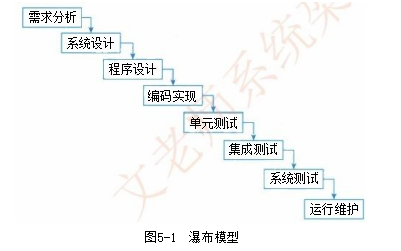
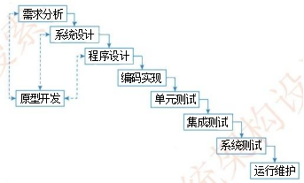
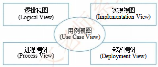
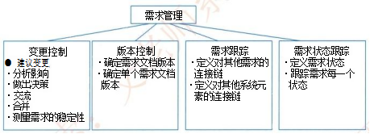
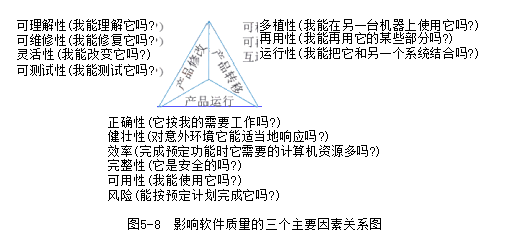

# 第五章 软件工程基础知识

 

本章主要讨论软件工程的基本概念，论述软件工程中基本的软件开发方法。按照常见的软 件开发阶段划分，分别讨论需求、分析、设计、编码和测试等环节中的常见方法和技术，并介 绍近年来出现的一些新的软件工程开发方法。

 

## 5.1 软件工程

20世纪60年代以前，计算机刚刚投入实际使用，软件设计往往只是为了 一个特定的应用 而在指定的计算机上进行设计和编制，采用密切依赖于计算机的机器代码或汇编语言，软件规 模比较小，文档资料通常也不存在，很少使用系统化的开发方法，设计软件往往等同于编制程 序，基本上是个人设计、个人使用、个人操作、自给自足的私人化的软件生产方式。

60年代中期，大容量、高速度计算机的出现，使计算机的应用范围迅速扩大，软件开 发量急剧长，软件系统的规模越来越大，复杂程度越来越高，软件可靠性问题也越来越突出。1968年，北大西洋公约组织 (NATO)  在联邦德国的国际学术会议首次提出了软件危机(Software Crisis)概 念 。

软件危机的具体表现为：

    - 软件开发进度难以预测；
    
    - 软件开发成本难以控制；
    
    - 软件功能难以满足用户期望；
    
    - 软件质量无法保证；
    
    - 软件难以维护；
    
    - 软件缺少适当的文档资料。

为了解决软件危机，1968、1969年NATO 连续召开了两次会议，提出了软件工程的概念。

### 5.1.1 软 件 工 程 定 义

软件工程一直以来都缺乏一个统一 的定义，很多学者和组织机构都分别给出了自己的定义：

    - Barry   Boehm: 运用现代科学技术知识来设计并构造计算机程序及为开发、运行和维护 这些程序所必须的相关文件资料。
    
    - IEEE:  软件工程是：①将系统化的、严格约束的、可量化的方法应用于软件的开发、运 行和维护，即将工程化应用于软件；②对①中所述方法的研究。
    
    - Fritz   Bauer: 在NATO 会议上给出的定义，建立并使用完善的工程化原则，以较经济的手 段获得能在实际机器上有效运行的可靠软件的一系列方法。
    
    - 《计算机科学技术百科全书》:软件工程是应用计算机科学、数学、逻辑学及管理科学 等原理，开发软件的工程。软件工程借鉴传统工程的原则和方法，以提高质量、降低成 本和改进算法。其中，计算机科学、数学用于构建模型与算法；工程科学用于制定规 范、设计范型 (Paradigm)、  评估成本及确定权衡；管理科学用于计划、资源、质量、 成本等管理。

软件工程过程是指为获得软件产品，在软件工具的支持下由软件工程师完成的一系列软件工程活动，包括以下4个方面。

    (1)P(Plan)——软件规格说明。规定软件的功能及其运行时的限制。
    
    (2)D(Do)——软件开发。开发出满足规格说明的软件。
    
    (3)C(Check)——软件确认。确认开发的软件能够满足用户的需求。
    
    (4)A(Action)——软件演进。软件在运行过程中不断改进以满足客户新的需求。

### 5.1.2  软 件 过 程 模 型

软件要经历从需求分析、软件设计、软件开发、运行维护，直至被淘汰这样的全过程，这 个全过程称为软件的生命周期。软件生命周期描述了软件从生到死的全过程。

为了使软件生命周期中的各项任务能够有序地按照规程进行，需要一定的工作模型对各项任务给予规程约束，这样的工作模型被称为软件过程模型，有时也称之为软件生命周期模型。

1. 瀑布模型

瀑 布 模 型 (Waterfall Model) 是最早使用的软件过程模型之一，包含一系列活动。这些活 动从一个阶段到另一个阶段逐次下降，它的工作流程在形式上很像瀑布，因此被称为瀑布模型， 如图5- 1 所示。

瀑布模型的特点是因果关系紧密相连，前一个阶段工作的输出结果，是后一个阶段工作的 输入。每一个阶段都是建筑在前一个阶段正确实施的结果之上。每一个阶段工作完成后都伴随 着一个里程碑(一组检查条件),对该阶段的工作进行审查和确认。历史上，瀑布模型起到了重要作用，它的出现有利于人员的组织管理，有利于软件开发方法和工具的研究。

瀑布模型的主要缺点有：

    (1)软件需求的完整性、正确性等很难确定，甚至是不可能和不现实的。因为用户不理解 计算机和软件系统，无法回答目标系统“做什么”,对系统将来的改变也难以确定，往往用“我 不能准确地告诉你”回答开发人员。
    
    (2)瀑布模型是 一个严格串行化的过程模型，使得用户和软件项目负责人要相当长的时间 才能得到一个可以看得见的软件系统。如果出现与用户的期望不一致，或者出现需求变更，将 会带来巨大的损失(例如人力、财力、时间等)。
    
    (3)瀑布模型的基本原则是在每个阶段一次性地完全解决该阶段的工作，不会出现遗漏、 错误等情况，而实际上这是不现实或不可能的。

2. 原型化模型

原型模型 (Prototype Model)又称快速原型。由于瀑布型的缺点，人们借鉴建筑师、工程 师建造原型的经验，提出了原型模型。该模型如图5-2所示。

 图5-2 原型模型

原型模型主要有以下两个阶段。

(1)原型开发阶段。软件开发人员根据用户提出的软件系统的定义，快速地开发一个原型。 该原型应该包含目标系统的关键问题和反映目标系统的大致面貌，展示目标系统的全部或部分 功能、性能等。

开发原型可以考虑以下3种途径。

   - 利用模拟软件系统的人机界面和人机交互方式。

   - 真正开发一个原型。

   - 找来一个或几个正在运行的类似软件进行比较。

(2)目标软件开发阶段。在征求用户对原型的意见后对原型进行修改完善，确认软件系统 的需求并达到一致的理解，进一步开发实际系统。但是，在实际工作中，由于各种原因，大多 数原型都废弃不用，仅仅把建立原型的过程当作帮助定义软件需要的一种手段。原型模型的使用应该注意以下内容。

   - 用户对系统的认识模糊不清，无法准确回答目标系统的需求。

   - 要有一定的开发环境和工具支持。

   - 经过对原型的若干次修改，应收敛到目标范围内，否则可能会失败。

   - 对大型软件来说，原型可能非常复杂而难以快速形成，如果没有现成的原型模型，就不 应考虑用原型法。

原型模型后续也发生了一些演变，按照原型的作用不同，出现了抛弃型原型和演化性原型。 抛弃型原型是将原型作为需求确认的手段，在需求确认结束后，原型就被抛弃不用，重新采用一个完整的瀑布模型进行开发。演化性原型是在需求确认结束后，不断补充和完善原型，直至 形成一个完整的产品。原型的概念也被后续出现的过程模型采纳，如螺旋模型和敏捷方法。

3. 螺 旋 模 型

螺 旋 模 型 (Spiral Model) 是在快速原型的基础上扩展而成。也有人把螺旋模型归到快速原 型，实际上，它是生命周期模型与原型模型的结合，如图5 - 3所示。这种模型把整个软件开发 流程分成多个阶段，每一个阶段都由4部分组成，它们是：

图5-3 螺旋模型

    1. 目标设定。为该项目进行需求分析，定义和确定这一个阶段的专门目标，指定对过程 和产品的约束，并且制订详细的管理计划。
    
    2. 风险分析。对可选方案进行风险识别和详细分析，制定解决办法，采取有效措施避免 这些风险。
    
    3. 开发和有效性验证。风险评估后，可以为系统选择开发模型，并且进行原型开发，即 开发软件产品。
    
    4. 评审。对项目进行评审，以确定是否需要进入螺旋线的下一次回路，如果决定继续， 就要制订下一阶段计划。

螺旋模型的软件开发过程实际是上述4个部分的迭代过程，每迭代一次，螺旋线就增加一圈，软件系统就生成一个新版本，这个新版本实际上是对目标系统的一个逼近。经过若干 次的迭代后，系统应该尽快地收敛到用户允许或可以接受的目标范围内，否则也有可能中途 夭折。

该模型支持大型软件开发，适用于面向规格说明、面向过程和面向对象的软件开发方法， 也适用于几种开发方法的组合。

 

### 5.1.3 敏 捷 模 型

软件开发在20世纪90年代受到两个大的因素影响：对内，面向对象编程开始取代面向过 程编程；对外，互联网泡沫导致快速投向市场以及公司的快速发展成为关键商业因素。快速变 化的需求需要短的产品交付周期，这与传统软件开发流程并不兼容。

2001年2月，17位著名的软件开发专家齐聚在美国犹他州雪鸟镇，举行了一次敏捷方法 发起者和实践者的聚会。在这次会议上，正式提出了Agile (敏捷)的概念，并共同签署了敏捷 宣言。

1. 敏捷方法的特点

敏捷型方法主要有两个特点，这也是其区别于其他方法，尤其是计划驱动或重型开发方法 的最主要的特征。

敏捷型方法是“适应性”(adaptive) 而非“预设性”(predictive) 的。重型方法试图对一个 软件开发项目在很长的时间跨度内做出详细的计划，然后依计划进行开发。这类方法在计划制 订完成后拒绝变化，而敏捷型方法欢迎变化。其实，敏捷的目的就是成为适应变化的过程，甚 至能允许改变自身来适应变化。

敏捷型方法是“面向人的”(People-oriented) 而非“面向过程的”(Process-oriented)。 它们 试图使软件开发工作能够充分发挥人的创造能力。它们强调软件开发应当是一项愉快的活动。

下面是对上面两点的详细解释。

    1). 适应性和预设性
    
    传统软件开发方法的基本思路一般是从其他工程领域借鉴而来，比如土木工程等。在这类 工程实践中，通常非常强调施工前的设计规划。只要图纸设计得合理并考虑充分，施工队伍可 以完全遵照图纸顺利建造，并且可以很方便地把图纸划分为许多更小的部分，交给不同的施工 人员分别完成。
    
    但是，软件开发与上面的土木工程有着显著的不同。软件的设计是难以实现的，并且需要昂贵的有创造性的人员。土木工程师在设计时所使用的模型是基于多年的工程实践，而且一些 设计上的关键部分都是建立在坚实的数学分析之上。而在软件设计中，完全没有类似的基础。 软件开发无法将设计和实施分离开来， 一些设计错误只能在编码和测试时才能发现，根本无法 做出一个交给程序员就能直接编码的软件设计。
    
    所以，软件过程不可能照搬其他工程领域原有的方法，需要有适应其特点的新开发方法。软件的设计之所以难以实现，问题在于软件需求的不稳定，从而导致软件过程的不可预测。
    
    但是，传统的控制项目的模式都是针对可预测的环境，在不可预测的环境下，往往无法使用这 些方法。但是，必须对这样的过程进行监控，以使得整个过程能向期望的目标前进。于是 Agile方 法引入“适应性”方法，该方法使用反馈机制对不可预测过程进行控制。
    
    2). 面向人而非面向过程
    
    传统计划驱动方法的目标之一是使得一个项目的参与人员成为可替代的部件。这样的一种 过程将人看成是一种资源，他们具有不同的角色，如分析员、程序员、测试员及管理人员。个 体是不重要的，只有角色才是重要的。这样考虑的一个重要的出发点就是：尽量减少人为因素 对开发过程的影响。但是，敏捷型方法则正好相反。
    
    计划驱动方法是让软件开发人员“服从"一个过程而非“接受” 一个过程。但是， 一个常 见的情况是：软件的开发过程是由管理人员决定的，而管理人员已经脱离实际开发活动相当长 的时间了，如此设计出来的开发过程是难以为开发人员所接受的。
    
    敏捷开发过程还要求开发人员必须有权做技术方面的所有决定。 IT 行业和其他行业不同， 其技术变化速度非常之快。今天的新技术可能几年后就过时了。只有在第一线的开发人员才能 真正掌握和理解开发过程中的技术细节。所以技术方面的决定必须由他们来做出。这样一来， 就使得开发人员和管理人员在一个软件项目的领导方面有同等的地位，他们共同对整个开发过 程负责。
    
    敏捷方法特别强调开发中相关人员之间的信息交流。 Alistair Cockburn 在对数十个项目的案 例调查分析后得出一个结论，“项目失败的原因最终都可以追溯到信息没有及时准确地传递到应 该接受它的人”。在开发过程中，项目的需求是在不断变化的，管理人员之间、开发人员之间以 及管理人员和开发人员之间，都必须不断地了解这些变化，对这些变化做出反应，并实施在随 后的开发过程中。
    
    敏捷方法还特别提倡直接的面对面交流。Alistair Cockburn 认为面对面交流的成本要远远低 于文档交流的成本。因此，敏捷方法一般都按照高内聚、低耦合的原则将项目划分为若干小组， 以增加沟通，提高敏捷性及应变能力。

2. 敏捷方法的核心思想

敏捷方法的核心思想主要有下面3点。

    (1)敏捷方法是适应型，而非可预测型。与传统方法不同，敏捷方法拥抱变化，也可以说 它的初衷就是适应变化的需求，利用变化来发展，甚至改变自己，最后完善自己。
    
    (2)敏捷方法是以人为本，而非以过程为本。传统方法以过程为本，强调充分发挥人的特性，不去限制它。并且软件开发在无过程控制和过于严格烦琐的过程控制中取得一种平衡，以 保证软件的质量。
    
    (3)迭代增量式的开发过程。敏捷方法以原型开发思想为基础，采用迭代增量式开发，发 行版本小型化。它根据客户需求的优先级和开发风险，制订版本发行计划，每一发行版都是在 前一成功发行版的基础上进行功能需求扩充，最后满足客户的所有功能需求。

3. 主要敏捷方法简介

这里简单介绍几种影响比较大的敏捷方法。

    (1)极限编程 (Extreme  Programming,XP)。在所有的敏捷型方法中， XP 是最引人瞩目的。
    
    极限编程是一个轻量级的、灵巧的软件开发方法；同时它也是一个非常严谨和周密的方法。它 的基础和价值观是交流、朴素、反馈和勇气，即任何一个软件项目都可以从4个方面入手进行 改善：加强交流；从简单做起；寻求反馈；勇于实事求是。XP 是一种近螺旋式的开发方法，它将复杂的开发过程分解为一个个相对比较简单的小周 期；通过积极的交流、反馈以及其他一系列的方法，开发人员和客户可以非常清楚开发进度、 变化、待解决的问题和潜在的困难等，并根据实际情况及时地调整开发过程。
    
    (2)水晶系列方法。水晶系列方法是由 Alistair Cockburn 提出的敏捷方法系列。它与XP  方法一样，都有以人为中心的理念，但在实践上有所不同。其目的是发展一种提倡“机动性 的"方法，包含具有共性的核心元素，每个都含有独特的角色、过程模式、工作产品和实践。 Crystal 家族实际上是一组经过证明、对不同类型项目非常有效的敏捷过程，它的发明使得敏捷 团队可以根据其项目和环境选择最合适的Crystal家族成员。
    
    (3)Scrum。 该方法侧重于项目管理。 Scrum 是迭代式增量软件开发过程，通常用于敏捷软 件开发。 Scrum 包括了一系列实践和预定义角色的过程骨架(是一种流程、计划、模式，用于 有效率地开发软件)。
    
    在Scrum 中，使用产品 Backlog 来管理产品的需求，产品 Backlog 是一个按照商业价值排 序的需求列表。根据Backlog 的内容，将整个开发过程被分为若干个短的迭代周期 (Sprint)。 在 Sprint 中， Scrum 团队从产品Backlog 中挑选最高优先级的需求组成 Sprint backlog。 在每个 迭代结束时， Scrum 团队将递交潜在可交付的产品增量。当所有Sprint结束时，团队提交最终 的软件产品。
    
    (4)特征驱动开发方法 (Feature Driven Development,FDD)。FDD是由 Jeff De Luca 和大 师 Peter Coad提出来的。 FDD 是一个迭代的开发模型。 FDD 认为有效的软件开发需要3个要素： 人、过程和技术。
    
    (5)FDD
    FDD 定义了6种关键的项目角色：项目经理、首席架构设计师、开发经理、主程序员、程 序员和领域专家。根据项目大小，部分角色可以重复。
    FDD 有5个核心过程：开发整体对象模型、构造特征列表、计划特征开发、特征设计和特 征构建。其中，计划特征开发根据构造出的特征列表、特征间的依赖关系进行计划，设计出包 含特征设计和特征构建过程组成的多次迭代。

### 5.1.4 统一过 程 模 型 (RUP)

软件统一过程 (Rational Unified Process,RUP) 是 Rational软件公司创造的软件工程方法。 RUP 描述了如何有效地利用商业的、可靠的方法开发和部署软件，是一种重量级过程。 RUP 类 似一个在线的指导者，它可以为所有方面和层次的程序开发提供指导方针、模版以及事例支持。

1. RUP 的生命周期

    RUP 软件开发生命周期是一个二维的软件开发模型，RUP 中有9个核心工作流，这9个核

    心工作流如下。

    - 业务建模 (Business    Modeling): 理解待开发系统所在的机构及其商业运作，确保所有 参与人员对待开发系统所在的机构有共同的认识，评估待开发系统对所在机构的影响。

    - 需求 (Requirements):    定义系统功能及用户界面，使客户知道系统的功能，使开发人 员理解系统的需求，为项目预算及计划提供基础。

    - 分析与设计 (Analysis&Design):     把需求分析的结果转化为分析与设计模型。

    - 实 现 (Implementation):     把设计模型转换为实现结果，对开发的代码做单元测试，将 不同实现人员开发的模块集成为可执行系统。

    - 测试 (Test):   检查各子系统之间的交互、集成，验证所有需求是否均被正确实现，对 发现的软件质量上的缺陷进行归档，对软件质量提出改进建议。

    - 部 署(Deployment):     打包、分发、安装软件，升级旧系统；培训用户及销售人员，并提供技术支持。

    - 配置与变更管理 (Configuration  &  Change  Management): 跟踪并维护系统开发过程中产生的所有制品的完整性和一致性。

    - 项目管理 (Project     Management): 为软件开发项目提供计划、人员分配、执行、监控 等方面的指导，为风险管理提供框架。

    - 环 境 (Environment):     为软件开发机构提供软件开发环境，即提供过程管理和工具的支持。

    需要说明的是表示核心工作流的术语 Discipline, 其的中文意义较多，根据RUP 的定义， Discipline 是相关活动的集合，这些活动都和项目的某一个方面有关，如这些活动都是和业务建 模相关的，或者都是和需求相关的，或者都是和分析设计相关的，等等。

    RUP 把软件开发生命周期划分为多个循环(Cycle), 每个循环生成产品的一个新的版本， 每个循环依次由4个连续的阶段 (Phase) 组成，每个阶段完成确定的任务。这4个阶段如下。

    - 初 始 (inception)  阶段：定义最终产品视图和业务模型，并确定系统范围。

    - 细化 (elaboration)   阶段：设计及确定系统的体系结构，制订工作计划及资源要求。

    - 构造 (construction)  阶段：构造产品并继续演进需求、体系结构、计划直至产品提交。

    - 移 交 (transition)  阶段：把产品提交给用户使用。

    每一个阶段都由一个或多个连续的迭代 (Iteration) 组成。迭代并不是重复地做相同的事， 而是针对不同用例的细化和实现。每一个迭代都是一个完整的开发过程，它需要项目经理根据当前迭代所处的阶段以及上次迭代的结果，适当地对核心工作流中的行为进行裁剪。

    在每个阶段结束前有一个里程碑 (Milestone) 评估该阶段的工作。如果未能通过该里程碑 的评估，则决策者应该做出决定，是取消该项目还是继续做该阶段的工作。

2. RUP 中的核心概念

    RUP 中定义了如下一些核心概念，理解这些概念对于理解RUP 很有帮助。

    - 角色 (Role):Who     的问题。角色描述某个人或一个小组的行为与职责。 RUP 预先 定义了很多角色，如体系结构师 (Architect)、 设计人员 (Designer)、  实现人员 (Implementer)、 测试员 (tester)和配置管理人员 (Configuration Manager) 等，并对 每一个角色的工作和职责都做了详尽的说明。

    - 活动 (Activity):How    的问题。活动是一个有明确目的的独立工作单元。

    - 制品 (Artifact):What   的问题。制品是活动生成、创建或修改的一段信息。也有些书把 Artifact翻译为产品、工件等，和制品的意思差不多。

    - 工作流 (Workflow):When    的问题。工作流描述了一个有意义的连续的活动序列，每 个工作流产生一些有价值的产品，并显示了角色之间的关系。

    RUP 2003对这些概念有比较详细的解释，并用类图描述了这些概念之间的关系，除了 角色、活动、制品和工作流这4个核心概念外，还有其他一些基本概念，如工具教程 (Tool Mentor)、 检 查 点(Checkpoints)、 模 板 (Template) 和报告 (Report) 等。

3. RUP 的特点

    RUP 是用例驱动的、以体系结构为中心的、迭代和增量的软件开发过程。下面对这些特点 做进一步的分析。

    1)用例驱动

    RUP 中的开发活动是用例驱动的，即需求分析、设计、实现和测试等活动都是用例驱 动的。

    2)以体系结构为中心

    RUP 中的开发活动是围绕体系结构展开的。软件体系结构的设计和代码设计无关，也不依 赖于具体的程序设计语言。软件体系结构是软件设计过程中的一个层次，这一层次超越计算过 程中的算法设计和数据结构设计。体系结构层次的设计问题包括系统的总体组织和全局控制、 通信协议、同步、数据存取、给设计元素分配功能、设计元素的组织、物理分布、系统的伸缩 性和性能等。

    体系结构的设计需要考虑多方面的问题：在功能性特征方面要考虑系统的功能；在非功能 性特征方面要考虑系统的性能、安全性和可用性等；与软件开发有关的特征要考虑可修改性、 可移植性、可重用性、可集成性和可测试性等；与开发经济学有关的特征要考虑开发时间、费 用、系统的生命期等。当然，这些特征之间有些是相互冲突的， 一个系统不可能在所有的特征 上都达到最优，这时就需要系统体系结构设计师在各种可能的选择之间进行权衡。

    对于一个软件系统，不同人员所关心的内容是不一样的。因此，软件的体系结构是一个多维的结构，也就是说，会采用多个视图 (View) 来描述软件体系结构。 RUP 采用如图5 - 4所示 的“4+1”视图模型来描述软件系统的体系结构。
    
    在“4+1”视图模型中，分析人员和测试人员关心的是系统的行为，会侧重于用例视图；最 终用户关心的是系统的功能，会侧重于逻辑视图；程序员关心的是系统的配置、装配等问题， 会侧重于实现视图；系统集成人员关心的是系统的性能、可伸缩性、吞吐率等问题，会侧重于 进程视图；系统工程师关心的是系统的发布、安装、拓扑结构等问题，会侧重于部署视图。

    图5-4 “4+1”视图模型

    3)迭代与增量

    RUP 强调采用迭代和增量的方式来开发软件，把整个项目开发分为多个迭代过程。在每次 迭代中，只考虑系统的一部分需求，进行分析、设计、实现、测试和部署等过程；每次迭代是 在已完成部分的基础上进行的，每次增加一些新的功能实现，以此进行下去，直至最后项目的 完成。软件开发采用迭代和增量的方式有以下好处。

    (1)在软件开发的早期就可以对关键的、影响大的风险进行处理。

    (2)可以提出一个软件体系结构来指导开发。

    (3)可以更好地处理不可避免的需求变更。

    (4)可以较早得到一个可运行的系统，鼓舞发团队的士气，增强项目成功的信心。

    (5)为开发人员提供一个能更有效工作的开发过程。

### 5.1.5  软 件 能 力 成 熟 度 模 型

软件能力成熟度模型 (Capability Maturity Model for Software,CMM) 是一个概念模型，模型框架和表示是刚性的，不能随意改变，但模型的解释和实现有一定弹性。 CMM  模 型 自 2 0 世纪80年代末推出，并于20世纪90年代广泛应用于软件过程的改进以来，极大地促进了软件生 产率的提高和软件质量的提高。CMMI(Capability Maturity Model Integration for Software, 软 件 能 力 成 熟 度 模 型 集 成 ) 是 在 CMM  的基础上发展而来的。 CMMI 是由美国卡耐基梅隆大学软件工程研究所 (Software  Engineering Institute,SEI)组织全世界的软件过程改进和软件开发管理方面的专家历时四年而 开发出来的，并在全世界推广实施的一种软件能力成熟度评估标准，主要用于指导软件开发过 程的改进和进行软件开发能力的评估。 CMMI 的推出，为软件产业的发展和壮大做出了巨大的 贡献。

CMMI 提供了一个软件能力成熟度的框架，它将软件过程改进的步骤组织成5个成熟度等 级，共包括18个关键过程域，52个过程目标，3168种关键时间，它为软件过程不断改进奠定 了一个循序渐进的基础。

1. Level1 初始级

处于成熟度级别1级时，过程通常是随意且混乱的。这些组织的成功依赖于组织内人员的 能力与英雄主义。成熟度1级的组织也常常能产出能用的产品与服务，但它们经常超出在计划 中记录的预算与成本。

2. Level2 已管理级

在该等级下，意味着组织要确保策划、文档化、执行、监督和控制项目级的过程，并且需 要为过程建立明确的目标，并能实现成本、进度和质量目标等。

3. Level3 已定义级

在这一等级，企业能够根据自身的特殊情况定义适合自己企业和项目的标准流程，将这套 管理体系与流程予以制度化，同时企业开始进行项目积累，企业资产的收集。

4. Level4  量化管理级

在成熟度4级，组织建立了产品质量、服务质量以及过程性能的定量目标。成熟度级别3 级与4级的关键区别在于对过程性能的可预测。

5. Level5 优化级

在优化级水平上，企业的项目管理达到了最高的境界。成熟度级别5级关注于通过增量式 的与创新式的过程与技术改进，不断地改进过程性能。处于成熟度5级时，组织使用从多个项 目收集来的数据对整体的组织级绩效进行关注。

有关软件能力成熟度模型的详细介绍，可参考CMM 相关专业书籍。

 

## 5.2 需求工程

软件需求目前并没有统一的定义，但都包含以下几方面的内容。

    (1)用户解决问题或达到目标所需条件或权能 (Capability)。
    
    (2)系统或系统部件要满足合同、标准、规范或其他正式规定文档所需具有的条件或权能。
    
    (3)一种反映上面(1)或(2)所述条件或权能的文档说明。它包括功能性需求及非功能 性需求，非功能性需求对设计和实现提出了限制，比如性能要求、质量标准或者设计限制。

在经典的瀑布软件过程模型中，将需求分析作为软件开发的第1个阶段，明确指出该阶段 的输出成果为用户原始需求说明书和软件需求描述规约。从这点看，需求阶段首先需要定义用 户的原始需求，并与用户、客户达成一致；其次，需要这对原始需求进行分析，给出一个初步 的软件解决方案，并给出该软件的需求描述规约，以指导后续的软件开发。这两个文档之间存 在一个转换过程。

软件需求包括3个不同的层次：业务需求、用户需求和功能需求(也包括非功能需求)。

    (1)业务需求 (business requirement) 反映了组织机构或客户对系统、产品高层次的目标 要求。
    
    (2)用户需求 (user requirement) 描述了用户使用产品必须要完成的任务，是用户对该软 件产品的期望。这两种构成了用户原始需求文档的内容。
    
    (3)功能需求 (functional requirement) 定义了开发人员必须实现的软件功能，使得用户能 完成他们的任务，从而满足业务需求。所谓特性 (feature)是指逻辑上相关的功能需求的集合， 给用户提供处理能力并满足业务需求。作为补充，软件需求规格说明还应包括非功能需求，它 描述了系统展现给用户的行为和执行的操作等。它包括产品必须遵从的标准、规范和合约；外 部界面的具体细节；性能要求；设计或实现的约束条件及质量属性。所谓约束是指对开发人员 在软件产品设计和构造上的限制，常见的有设计约束和过程约束。质量属性是通过多种角度对 产品的特点进行描述，从而反映产品功能。多角度描述产品对用户和开发人员都极为重要。

开发软件系统最困难的部分就是准确说明开发什么，因为用户往往很难给出完整正确的原 始需求，也很难想象出未来的软件应该提供哪些功能，以解决自己的业务问题。这些都需要软 件开发人员协助，通过多次的讨论方能最终确认。而如果前期需求分析不透彻， 一旦出错，将 最终会给系统带来极大损害，并且以后再对它进行修改也极为困难，容易导致项目失败。

1987年， Frederick Brooks在 "No Silver Bullet: Essence and Accidents of Software Engineering”中，充分说明了需求过程在软件项目中扮演的重要角色。

20世纪80年代中期，形成了软件工程的子领域，需求工程 (Requirement Engineering, RE)。 需求工程是随着计算机的发展而发展的，在计算机发展的初期，软件规模不大，软件开 发所关注的是代码编写，需求分析很少受到重视。随着软件系统规模的扩大，需求分析与定义 在整个软件开发与维护过程中越来越重要，直接关系到软件的成功与否。人们逐渐认识到需求 分析活动不再仅限于软件开发的最初阶段，它贯穿于系统开发的整个生命周期。

需求工程是指应用已证实有效的原理、方法，通过合适的工具和记号，系统地描述待开发 系统及其行为特征和相关约束。需求工程覆盖了体系结构设计之前的各项开发活动，主要包括 分析客户要求、对未来系统的各项功能性及非功能性需求进行规格说明。需求工程的目标简单 明了：确定客户需求，定义设想中系统的所有外部特征。

需求工程的活动主要被划分为以下几个阶段。

    (1)需求获取：通过与用户的交流，对现有系统的观察及对任务进行分析，从而开发、捕 获和修订用户的需求。
    
    (2)需求分析：为系统建立一个概念模型，作为对需求的抽象描述，并尽可能多的捕获现 实世界的语义。
    
    (3)形成需求规格(或称之为需求文档化):按照相关标准，生成需求模型的文档描述，用 户原始需求书作为用户和开发者之间的一个协约，往往被作为合同的附件；软件需求描述规约 作为后续软件系统开发的指南。
    
    (4)需求确认与验证：以需求规格说明为输入，通过用户确认、复审会议、符号执行、模 拟仿真或快速原型等途径与方法，确认和验证需求规格的完整性、正确性、 一致性、可测试性 和可行性，包含有效性检查、 一致性检查、可行性检查和确认可验证性。
     
    (5)需求管理：包括需求文档的追踪管理、变更控制、版本控制等管理性活动。

软件需求开发的最终文档经过评审批准后，则定义了开发工作的需求基线 (Baseline)。 这 个基线在客户和开发者之间构筑了计划产品功能需求和非功能需求的 一个约定 (Agreement)。

需求约定是需求开发和需求管理之间的桥梁。

需求管理是一个对系统需求变更、了解和控制的过程。需求管理过程与需求开发过程相互 关联，当初始需求导出的同时就启动了需求管理规划， 一旦形成了需求文档的初稿，需求管理 活动就开始了。需求管理的主要活动如图5-5所示。

图5-5 需求管理的主要活动

需求管理强调的内容如下。

    (1)控制对需求基线的变动。
    
    (2)保持项目计划与需求 一致。
    
    (3)控制单个需求和需求文档的版本情况。
    
    (4)管理需求和联系链，或管理单个需求和其他项目可交付产品之间的依赖关系。
    
    (5)跟踪基线中的需求状态。

由于需求分析的方法有很多种，后面将结合具体的开发方法进行相关论述。

 

### 5.2.1  需 求 获 取

用户需求陈述可能由用户单方面写出，也可能由业务分析员、系统分析员配合用户共同写 出。需求陈述的内容包括问题范围、功能需求、应用环境及假设条件等。此外，也包含涉及相 关软件工程标准、技术方案、将来可能做的扩充及可维护性要求等方面的约束条件。总之，需 求陈述应该阐明“做什么”,而不是“怎样做”。

需求获取是开发者、用户之间为了定义新系统而进行的交流，需求获取是获得系统必要的 特征，或者是获得用户能接受的、系统必须满足的约束。如果双方所理解的领域内容在系统分 析、设计过程出现问题，通常在开发过程的后期才会被发现，将会使整个系统交付延迟，或上 线的系统无法或难以使用，最终导致项目失败。例如，遗漏的需求或理解错误的需求。

1. 需求获取的基本步骤

对于不同规模及不同类型的项目，需求获取的过程不会完全一样。下面给出需求获取过程的参考步骤。

    1)开发高层的业务模型
    
    所谓应用领域，即目标系统的应用环境，如银行、电信公司等。如果系统分析员对该领域 有了充分了解，就可以建立一个业务模型，描述用户的业务过程，确定用户的初始需求。然后 通过迭代，更深入地了解应用领域，之后再对业模型进行改进。
    
    2)定义项目范围和高层需求
    
    在项目开始之前，应当在所有涉众(项目的利益攸关方)之间建立共同的项目愿景，即定 义项目范围和高层需求。项目范围描述系统的边界以及系统与系统交互的参与者之间(包括组 织、人、硬件设备、其他软件等)的关系。高层需求不涉及过多的细节，主要表示系统需求的 概貌。常见的建模手段包括系统上下文图和系统顶层用例图等。
    
    3)识别用户角色和用户代表
    
    涉众不仅包括传统的用户、客户等，还包括测试人员、维护人员、市场人员等，他们也对 项目有利益诉求。因此，首先确定所有涉众，然后挑选出每一类涉众并与他们一起工作。
    
    用户角色可以是人，也可以是与系统打交道的其他应用程序或硬件部件。如果是其他应用 程序或硬件部件，则需要以熟悉这些系统或硬件的人员作为用户代表。
    
    4)获取具体的需求
    
    确定了项目范围和高层需求，并确定了所有涉众后，就需要获取每个涉众的具体、完整和 详细的需求。
    
    5)确定目标系统的业务工作流
    
    具体到当前待开发的应用系统，确定系统的业务工作流和主要的业务规则。往往需要采取 多重方法来获取所需的信息。
    
    6)需求整理与总结
    
    最后对上面步骤取得的需求资料进行整理和总结，确定对软件系统的综合要求，即软件的 需求。并提出这些需求的实现条件，以及需求应达到的标准。这些需求包括功能需求、性能需 求、环境需求、可靠性需求、安全保密需求、用户界面需求、资源使用需求、软件成本消耗与 开发进度需求等。

2. 需求获取方法

    针对不同类型的软件项目，需要采用不同的需求获取方法。常见的需求获取方法如下。

    1)用户面谈

    这是一种最为常见的需求获取方法，是理解用户需求的最有效方法。面谈过程需要认真的 计划和准备；面谈之后，需要复查笔记的准确性、完整性和可理解性；把所收集的信息转化为 适当的模型和文档；确定需要进一步澄清的问题。

    2)需求专题讨论会

    需求专题讨论会也是需求获取的一种有力技术。在短暂而紧凑的时间段内将相关涉众集中 在一起集体讨论，与会者可以在应用需求上达成共识，对操作过程尽快取得统一的意见。参加会议的人员包括主持人、用户、技术人员、项目组人员。

    专题讨论会具有以下优点。

        (1)协助建立一支高效的团队，围绕项目成功的目标。
        
        (2)所有的风险承担人都畅所欲言。
        
        (3)促进风险承担人和开发团队之间达成共识。
        
        (4)揭露和解决那些妨碍项目成功的行政问题。
        
        (5)能够很快地产生初步的系统定义。
        
        (6)可以有效地解决不同涉众之间的需求冲突。

    3)问卷调查

    问卷调查可用于确认假设和收集统计倾向数据。存在的问题是：相关问题不能事先决定， 问题背后的假设对答案造成偏颇，难以探索一些新领域，难以继续用户的模糊响应。在完成最 初的面谈和分析后，问卷调查可作为一项协作技术收到良好效果。

    4)现场观察

    该方法主要是通过观察用户实际执行业务的过程，来直观地了解业务的执行过程，全面了 解需求细节。执行业务可能是手工操作，也可能是在原有的业务系统上执行。

    5)原型化方法

    在需求的早期，用户往往在具体的需求定义上存在很多不确定性，尤其是信息系统的人机 交互界面和查询报表类的需求上。此时往往可以通过在需求阶段采用原型化方法，通过开发系 统原型以及与用户的多次迭代反馈，解决在早期阶段需求不确定的问题，尤其是在人机界面等 高度不确定的需求。

    6)头脑风暴法

    在一些新业务拓展的软件项目中，由于业务是新出现的，而且业务流程存在高度的不确定 性，例如互联网上的新业务系统、 App 等， 一群人围绕该业务，发散思维，不断产生新的观点， 参会者敞开思想使各种设想在相互碰撞中激起大脑的创造性风暴，从而确定具体的需求。

### 5.2.2 需求变更

在当前的软件开发过程中，需求变更已经成为一种常态。需求变更的原因有很多种，可能 是需求获取不完整，存在遗漏的需求；可能是对需求的理解产生了误差；也可能是业务变化导 致了需求的变化等。 一些需求的改进是合理的而且不可避免，要使得软件需求完全不变更，基 本上是不可能的。但毫无控制的变更会导致项目陷入混乱，不能按进度完成或者软件质量无法 保证。

事实上，迟到的需求变更会对已进行的工作产生非常大的影响。如果不控制变更的影响范 围，在项目开发过程中持续不断地采纳新功能，不断地调整资源、进度或者质量标准是极为有 害的。如果每一个建议的需求变更都采用，该项目将有可能永远不能完成。

软件需求文档应该精确描述要交付的产品，这是一个基本的原则。为了使开发组织能够严 格控制软件项目，应该确保以下事项：

   - 仔细评估已建议的变更。

   - 挑选合适的人选对变更做出判定。

   - 变更应及时通知所有相关人员。

   - 项目要按一定的程序来采纳需求变更，对变更的过程和状态进行控制。

1. 变更控制过程

    变更控制过程用来跟踪已建议变更的状态，使已建议的变更确保不会丢失或疏忽。 一旦确 定了需求基线，应该使所有已建议的变更都遵循变更控制过程。

    需求变更管理过程如图5-6所示。

    图5-6 需求变更管理过程

    (1)问题分析和变更描述。当提出 一份变更提议后，需要对该提议做进一步的问题分析， 检查它的有效性，从而产生一个更明确的需求变更提议。

    (2)变更分析和成本计算。当接受该变更提议后，需要对需求变更提议进行影响分析和评 估。变更成本计算应该包括对该变更所引起的所有改动的成本，例如修改需求文档、相应的设 计、实现等工作成本。 一旦分析完成并且被确认，应该进行是否执行这一变更的决策。

    (3)变更实现。当确定执行该变更后，需要根据该变更的影响范围，按照开发的过程模型 执行相应的变更。在计划驱动过程模型中，往往需要回溯到需求分析阶段开始，重新作对应的 需求分析、设计和实现等步骤；在敏捷开发模型中，往往会将需求变更纳入到下一次迭代的执 行过程中。

    变更控制过程并不是给变更设置障碍。相反地，它是一个渠道和过滤器，通过它可以确保 采纳最合适的变更，使变更产生的负面影响降到最低。

    控制需求变更与项目其他配置的管理决策也有着密切的联系。项目管理应该达成一个策略， 用来描述如何处理需求变更，而且策略应具有现实可行性。

    常见的需求变更策略：

        (1)所有需求变更必须遵循变更控制过程。
        
        (2)对于未获得批准的变更，不应该做设计和实现工作。
        
        (3)变更应该由项目变更控制委员会决定实现哪些变更。
        
        (4)项目风险承担者应该能够了解变更的内容。
        
        (5)绝不能从项目配置库中删除或者修改变更请求的原始文档。
        
        (6)每一个集成的需求变更必须能跟踪到一个经核准的变更请求，以保持水平可追踪性。

    目前存在很多需求变更跟踪工具，这些工具用来收集、存储和管理需求变更。问题跟踪工 具也可以随时按变更状态分类报告变更请求的数目。

2. 变更控制委员会

    变更控制委员会 (Change Control Board,CCB) 是项目所有者权益代表，负责裁定接受哪 些变更。 CCB 由项目所涉及的多方成员共同组成，通常包括用户和实施方的决策人员。 CCB 是 决策机构，不是作业机构，通常CCB  的工作是通过评审手段来决定项目是否能变更，但不提出 变更方案。

    变更控制委员会可能包括如下方面的代表。

        (1)产品或计划管理部门。
        
        (2)项目管理部门。
        
        (3)开发部门。
        
        (4)测试或质量保证部门。
        
        (5)市场部或客户代表。
        
        (6)制作用户文档的部门。
        
        (7)技术支持部门。
        
        (8)帮助桌面或用户支持热线部门。
        
        (9)配置管理部门。

    变更控制委员会应该有一个总则，用于描述变更控制委员会的目的、授权范围、成员构成、 做出决策的过程及操作步骤。总则也应该说明举行会议的频度和事由。管理范围描述该委员会 能做什么样的决策，以及有哪一类决策应上报到高一级的委员会。过程及操作步骤如下。

    1)制定决策

    制定决策过程的描述应确认：

    - 变更控制委员会必须到会的人数或做出有效决定必须出席的人数。

    - 决策的方法(例如投票， 一致通过或其他机制)。

    - 变更控制委员会主席是否可以否决该集体的决定。

    变更控制委员会应该对每个变更权衡利弊后做出决定。“利”包括节省的资金或额外的收 入、增强的客户满意度、竞争优势、减少上市时间；“弊”是指接受变更后产生的负面影响，包 括增加的开发费用、推迟的交付日期、产品质量的下降、减少的功能、用户不满意度。

    2)交流情况

    一旦变更控制委员会做出决策，指派的人员应及时更新请求的状态。

    3)重新协商约定

    变更总是有代价的，即使拒绝的变更也因为决策行为(提交、评估、决策)而耗费了资源。 当项目接受了重要的需求变更时，为了适应变更情况要与管理部门和客户重新协商约定。协商 的内容可能包括推迟交货时间、要求增加人手、推迟实现尚未实现的较低优先级的需求，或者 质量上进行折中。

### 5.2.3 需 求 追 踪

需求跟踪包括编制每个需求同系统元素之间的联系文档，这些元素包括其他需求、体系结 构、其他设计部件、源代码模块、测试、帮助文件和文档等，是要在整个项目的工件之间形成 水平可追踪性。跟踪能力信息使变更影响分析十分便利，有利于确认和评估实现某个建议的需 求变更所必须的工作。

需求跟踪提供了由需求到产品实现整个过程范围的明确查阅的能力。需求跟踪的目的是建 立与维护“需求-设计-编程-测试”之间的一致性，确保所有的工作成果符合用户需求。

需求跟踪有两种方式：

    (1)正向跟踪。检查《产品需求规格说明书》中的每个需求是否都能在后继工作成果中找 到对应点。
    
    (2)逆向跟踪。检查设计文档、代码、测试用例等工作成果是否都能在《产品需求规格说 明书》中找到出处。

正向跟踪和逆向跟踪合称为“双向跟踪”。不论采用何种跟踪方式，都要建立与维护需求跟 踪矩阵(即表格)。需求跟踪矩阵保存了需求与后继工作成果的对应关系。

跟踪能力是优秀需求规格说明书的一个特征，为了实现可跟踪能力，必须统一地标识出每 一个需求，以便能明确地进行查阅。

需求跟踪是个要求手工操作且劳动强度很大的任务，要求组织提供支持。随着系统开发的 进行和维护的执行，要保持关联信息与实际一致。跟踪能力信息一旦过时，可能再也不会重建 它。在实际项目中，往往采用专门的配置管理工具来实现需求跟踪。

 

## 5.3 系统分析与设计

系统分析阶段是应用系统思想和方法，把复杂的对象分解为简单的组成部分，找出这些部 分的基本属性和彼此之间的关系的过程，其基本任务是系统分析师和用户在充分了解用户需求 的基础上，把双方对新系统的理解表达为系统需求规格说明书。

系统设计的目标是根据系统分析的结果，完成系统的构建过程。其主要目的是绘制系统的 蓝图，权衡和比较各种技术和实施方法的利弊，合理分配各种资源，构建新系统的详细设计方 案和相关模型，指导系统实施工作的顺利开展。系统设计的主要内容包括概要设计和详细设计。

### 5.3.1 结 构 化 方 法

1978年， E.Yourdon 和 L.L.Constantine提出了结构化方法，即SASD(Structured Analysis  and Structured Design) 方法，也可称为面向功能的软件开发方法或面向数据流的软件开发方法。 Yourdon 方法是20世纪80年代使用最广泛的软件开发方法。

结构化开发方法提出了一组提高软件结构合理性的准则，如分解与抽象、模块独立性、信 息隐蔽等。针对软件生存周期各个不同的阶段，它有结构化分析 (SA)、 结构化设计 (SD) 和 结构化编程 (SP) 等方法。

1. 结构化分析

    结构化分析方法给出一组帮助系统分析人员产生功能规约的原理与技术。它一般利用图 形表达用户需求，使用的手段主要有数据流图、数据字典、结构化语言、判定表以及判定 树等。

    结构化分析的步骤如下：

        (1)分析业务情况，做出反映当前物理模型的数据流图(Data Flow Diagram,DFD);
    
        (2)推导出等价的逻辑模型的DFD;
    
        (3)设计新的逻辑系统，生成数据字典和基元描述；
    
        (4)建立人机接口，提出可供选择的目标系统物理模型的DFD;
    
        (5)确定各种方案的成本和风险等级，据此对各种方案进行分析；
    
        (6)选择一种方案；
    
        (7)建立完整的需求规约。

    结构化分析的常用手段是数据流图 (DFD) 和数据字典。

    1)数据流图

    DFD 需求建模方法，也称为过程建模和功能建模方法。 DFD 建模方法的核心是数据流，从 应用系统的数据流着手以图形方式刻画和表示一个具体业务系统中的数据处理过程和数据流。 DFD 建模方法首先抽象出具体应用的主要业务流程，然后分析其输入，如其初始的数据有哪 些，这些数据从哪里来，将流向何处，又经过了什么加工，加工后又变成了什么数据，这些数 据流最终将得到什么结果。通过对系统业务流程的层层追踪和分析把要解决的问题清晰地展现 及描述出来，为后续的设计、编码及实现系统的各项功能打下基础。

    DFD 方法由4种基本元素(模型对象)组成：数据流、处理/加工、数据存储和外部项。

        (1)数据流 (Data Flow)。 数据流用一个箭头描述数据的流向，箭头上标注的内容可以是 信息说明或数据项。
    
        (2)处理 (Process)。 表示对数据进行的加工和转换，在图中用矩形框表示。指向处理的 数据流为该处理的输入数据，离开处理的数据流为该处理的输出数据。
    
        (3)数据存储。表示用数据库形式(或者文件形式)存储的数据，对其进行的存取分别以 指向或离开数据存储的箭头表示。
    
        (4)外部项。也称为数据源或者数据终点。描述系统数据的提供者或者数据的使用者，如 教师、学生、采购员、某个组织或部门或其他系统，在图中用圆角框或者平行四边形框表示。

    建立DFD 图的目的是描述系统的功能需求。 DFD 方法利用应用问题域中数据及信息的提 供者与使用者、信息的流向、处理、存储4种元素描述系统需求，建立应用系统的功能模型。 具体的建模过程及步骤如下。

        (1)明确目标，确定系统范围。
    
        首先要明确目标系统的功能需求，并将用户对目标系统的功能需求完整、准确、 一致地描 述出来，然后确定模型要描述的问题域。虽然在建模过程中这些内容是逐步细化的，但必须自 始自终保持一致、清晰和准确。
    
        (2)建立顶层DFD 图。
    
        顶层 DFD 图表达和描述了将要实现的系统的主要功能，同时也确定了整个模型的内外关 系，表达了系统的边界及范围，也构成了进一步分解的基础。
    
        (3)构建第 一层DFD 分解图。
    
        根据应用系统的逻辑功能，把顶层DFD 图中的处理分解成多个更细化的处理。
    
        (4)开发DFD 层次结构图。
    
        对第一层 DFD 分解图中的每个处理框作进一步分解，在分解图中要列出所有的处理及其相 关信息，并要注意分解图中的处理与信息包括父图中的全部内容。分解可采用以下原则：保持 均匀的模型深度；按困难程度进行选择；如果一个处理难以确切命名，可以考虑对它重新分解。
    
        (5)检查确认DFD 图。

    按照规则检查和确定DFD 图，以确保构建的DFD 模型是正确的、 一致的，且满足要求。 具体规则包括：父图中描述过的数据流必须要在相应的子图中出现； 一个处理至少有一个输入 流和一个输出流； 一个存储必定有流入的数据流和流出的数据流； 一个数据流至少有一端是处 理端；模型图中表达和描述的信息是全面的、完整的、正确的和一致的。

    经过以上过程与步骤后，顶层图被逐层细化，同时也把面向问题的术语逐渐转化为面向现 实的解法，并得到最终的DFD 层次结构图。层次结构图中的上一层是下一层的抽象，下一层是 上一层的求精和细化，而最后一层中的每个处理都是面向一个具体的描述，即一个处理模块仅 描述和解决一个问题。

    2)数据字典

    数据字典 (Data Dictionary) 是一种用户可以访问的记录数据库和应用程序元数据的目录。 数据字典是指对数据的数据项、数据结构、数据流、数据存储、处理逻辑等进行定义和描述， 其目的是对数据流程图中的各个元素做出详细的说明。简而言之，数据字典是描述数据的信息 集合，是对系统中使用的所有数据元素定义的集合。

    数据字典最重要的作用是作为分析阶段的工具。任何字典最重要的用途都是供人查询，在 结构化分析中，数据字典的作用是给数据流图上每个元素加以定义和说明。换句话说，数据流 图上所有元素的定义和解释的文字集合就是数据字典。数据字典中建立的严密一致的定义，有 助于改进分析员和用户的通信与交互。数据字典各部分的描述如下。

        (1)数据项：数据流图中数据块的数据结构中的数据项说明。数据项是不可再分的数据单 位。对数据项的描述通常包括以下内容：
    
        数据项描述={数据项名，数据项含义说明，别名，数据类型，长度，取值范围，取值含 义，与其他数据项的逻辑关系}
    
        其中“取值范围”“与其他数据项的逻辑关系”定义了数据的完整性约束条件，是设计数据 检验功能的依据。若干个数据项可以组成一个数据结构。
    
        (2)数据结构：数据流图中数据块的数据结构说明。数据结构反映了数据之间的组合关系。 一个数据结构可以由若干个数据项组成，也可以由若干个数据结构组成，或由若干个数据项和 数据结构混合组成。对数据结构的描述通常包括以下内容：
    
        数据结构描述={数据结构名，含义说明，组成：{数据项或数据结构}}
    
        (3)数据流：数据流图中流线的说明。数据流是数据结构在系统内传输的路径。对数据流 的描述通常包括以下内容：
    
        数据流描述={数据流名，说明，数据流来源，数据流去向，组成：{数据结构},平均流 量，高峰期流量}
    
        其中“数据流来源”是说明该数据流来自哪个过程，即数据的来源。“数据流去向”是说 明该数据流将到哪个过程去，即数据的去向。“平均流量”是指在单位时间(每天、每周、每月 等)里的传输次数。“高峰期流量”则是指在高峰时期的数据流量。
    
        (4)数据存储：数据流图中数据块的存储特性说明。数据存储是数据结构停留或保存的地 方，也是数据流的来源和去向之一。对数据存储的描述通常包括以下内容：
    
        数据存储描述={数据存储名，说明，编号，流入的数据流，流出的数据流，组成：{数据 结构},数据量，存取方式}
    
        其中“数据量”是指每次存取多少数据，每天(或每小时、每周等)存取几次等信息。“存 取方式"包括是批处理，还是联机处理；是检索还是更新；是顺序检索还是随机检索等。另外 “流入的数据流”要指出其来源，“流出的数据流”要指出其去向。
    
        (5)处理过程：数据流图中功能块的说明。数据字典中只需要描述处理过程的说明性信息， 通常包括以下内容：
    
        处理过程描述={处理过程名，说明，输入：{数据流},输出：{数据流},处理：{简要 说明}}
    
        其中“简要说明”中主要说明该处理过程的功能及处理要求。功能是指该处理过程用来做 什么(并不是怎么样做);处理要求包括处理频度要求，如单位时间里处理多少事务，多少数据 量，响应时间要求等，这些处理要求是后面物理设计的输入及性能评价的标准。

2. 结构化设计

    结构化设计 (Structured Design,SD) 是一种面向数据流的设计方法，它以 SRS 和 SA 阶段 所产生的数据流图和数据字典等文档为基础，是一个自顶向下、逐步求精和模块化的过程。 SD  方法的基本思想是将软件设计成由相对独立且具有单一功能的模块组成的结构，分为概要设计 和详细设计两个阶段，其中概要设计的主要任务是确定软件系统的结构，对系统进行模块划分， 确定每个模块的功能、接口和模块之间的调用关系；详细设计的主要任务是为每个模块设计实 现的细节。

    1)模块结构

    系统是一个整体，它具有整体性的目标和功能，但这些目标和功能的实现又是由相互联系 的各个组成部分共同工作的结果。人们在解决复杂问题时使用的一个很重要的原则，就是将它 分解成多个小问题分别处理，在处理过程中，需要根据系统总体要求，协调各业务部门的关系。 在 SD 中，这种功能分解就是将系统划分为模块，模块是组成系统的基本单位，它的特点是可 以自由组合、分解和变换，系统中任何一个处理功能都可以看成一个模块。

    (1)信息隐藏与抽象。

    信息隐藏原则要求采用封装技术，将程序模块的实现细节(过程或数据)隐藏起来，对于 不需要这些信息的其他模块来说是不能访问的，使模块接口尽量简单。按照信息隐藏的原则， 系统中的模块应设计成“黑盒”,模块外部只能使用模块接口说明中给出的信息，例如，操作和 数据类型等。模块之间相对独立，既易于实现，也易于理解和维护。

    抽象原则要求抽取事物最基本的特性和行为，忽略非本质的细节，采用分层次抽象的方式 可以控制软件开发过程的复杂性，有利于软件的可理解性和开发过程的管理。通常，抽象层次 包括过程抽象、数据抽象和控制抽象。

    (2)模块化。

    在 SD 方法中，模块是实现功能的基本单位，它一般具有功能、逻辑和状态3个基本属性， 其中功能是指该模块“做什么”,逻辑是描述模块内部“怎么做”,状态是该模块使用时的环境 和条件。在描述一个模块时，必须按模块的外部特性与内部特性分别描述。模块的外部特性是 指模块的模块名、参数表和给程序乃至整个系统造成的影响，而模块的内部特性则是指完成其 功能的程序代码和仅供该模块内部使用的数据。对于模块的外部环境(例如，需要调用这个模 块的上级模块)来说，只需要了解这个模块的外部特性就足够了，不必了解它的内部特性。而 软件设计阶段，通常是先确定模块的外部特性，然后再确定它的内部特性。

    (3)耦合。

    耦合表示模块之间联系的程度。紧密耦合表示模块之间联系非常强，松散耦合表示模块之 间联系比较弱，非直接耦合则表示模块之间无任何直接联系。模块的耦合类型通常分为7种， 根据耦合度从低到高排序如表5-1所示。

    表5-1 模块的耦合类型
    

    | 耦合类型   | 描述                                                         |
    | ---------- | ------------------------------------------------------------ |
    | 非直接耦合 | 两个模块之间没有直接关系，它们之间的联系完全是通过上级模块的控制和调用来实现的 |
    | 数据耦合   | 一组模块借助参数表传递简单数据                               |
    | 标记耦合   | 一组模块通过参数表传递记录等复杂信息(数据结构)               |
    | 控制耦合   | 模块之间传递的信息中包含用于控制模块内部逻辑的信息           |
    | 通信耦合   | 一组模块共用了一组输入信息，或者它们的输出需要整合以形成完整数据，即共享了输入 或输出 |
    | 公共耦合   | 多个模块都访问同一个公共数据环境，公共的数据环境可以是全局数据结构、共享的通信 区、内存的公共覆盖区等 |
    | 内容耦合   | 一个模块直接访问另一个模块的内部数据； 一个模块不通过正常入口转到另一个模块的内 部；两个模块有一部分程序代码重叠； 一个模块有多个入口等 |

    对于模块之间耦合的强度，主要依赖于一个模块对另一个模块的调用、 一个模块向另一个 模块传递的数据量、 一个模块施加到另一个模块的控制的多少，以及模块之间接口的复杂程度。

    (4)内聚。

    内聚表示模块内部各代码成分之间联系的紧密程度，是从功能角度来度量模块内的联系，

    一个好的内聚模块应当恰好做目标单一 的一件事情。模块的内聚类型通常也可以分为7种，根 据内聚度从高到低的排序如表5-2所示。

    表5-2 模块的内聚类型

    | 内聚类型 | 描述                                         |
    | -------- | -------------------------------------------- |
    | 功能内聚 | 完成一个单一功能，各个部分协同工作，缺一不可 |
    | 顺序内聚 | 处理元素相关，而且必须顺序执行               |
    | 通信内聚 | 所有处理元素集中在一个数据结构的区域上       |
    | 过程内聚 | 处理元素相关，而且必须按特定的次序执行       |
    | 时间内聚 | 所包含的任务必须在同一时间间隔内执行         |
    | 逻辑内聚 | 完成逻辑上相关的一组任务                     |
    | 偶然内聚 | 完成一组没有关系或松散关系的任务             |
    
    一般说来，系统中各模块的内聚越高，则模块间的耦合就越低，但这种关系并不是绝对的。 耦合低使得模块间尽可能相对独立，各模块可以单独开发和维护；内聚高使得模块的可理解性 和维护性大大增强。因此，在模块的分解中应尽量减少模块的耦合，力求增加模块的内聚，遵 循“高内聚、低耦合”的设计原则。

   2). 系统结构图

    系统结构图(Structure Chart,SC) 又称为模块结构图，它是软件概要设计阶段的工具，反 映系统的功能实现和模块之间的联系与通信，包括各模块之间的层次结构，即反映了系统的总 体结构。在系统分析阶段，系统分析师可以采用SA 方法获取由DFD、 数据字典和加工说明等 组成的系统的逻辑模型；在系统设计阶段，系统设计师可根据一些规则，从DFD 中导出系统初 始的 SC。
    
    详细设计的主要任务是设计每个模块的实现算法、所需的局部数据结构。详细设计的目标 有两个：实现模块功能的算法要逻辑上正确和算法描述要简明易懂。详细设计必须遵循概要设 计来进行。详细设计方案的更改，不得影响到概要设计方案；如果需要更改概要设计，必须经 过项目经理的同意。详细设计，应该完成详细设计文档，主要是模块的详细设计方案说明。
    
    设计的基本步骤如下。
    
        (1)分析并确定输入/输出数据的逻辑结构。
    
        (2)找出输入数据结构和输出数据结构中有对应关系的数据单元。
    
        (3)按一定的规则由输入、输出的数据结构导出程序结构。
    
        (4)列出基本操作与条件，并把它们分配到程序结构图的适当位置。
    
        (5)用伪码写出程序。
    
    详细设计的表示工具有图形工具、表格工具和语言工具。
    
        (1)图形工具。
    
        利用图形工具可以把过程的细节用图形描述出来。具体的图形有业务流图、程序流程图、

        PAD(Problem Analysis Diagram) 图 、NS 流程图(由Nassi和 Shneiderman开发，简称 NS) 等。
    
        程序流程图又称为程序框图，是使用最广泛然的一种描述程序逻辑结构的工具。它用方框 表示一个处理步骤，菱形表示一个逻辑条件，箭头表示控制流向。其优点是：结构清晰，易于 理解，易于修改。缺点是：只能描述执行过程而不能描述有关的数据。
    
        NS 流程图，也称为盒图，是一种强制使用结构化构造的图示工具，也称为方框图。其具有 以下特点：功能域明确、不可能任意转移控制、很容易确定局部和全局数据的作用域、很容易 表示嵌套关系及模板的层次关系。
    
        PAD 图是一种改进的图形描述方式，可以用来取代程序流程图，相比程序流程图更直观， 结构更清晰。最大的优点是能够反映和描述自顶向下的历史和过程。 PAD 提供了5种基本控制  结构的图示，并允许递归使用。 PAD 的特点如下：
    
        - 使用PAD符号设计出的程序代码是结构化程序代码；
    
        - PAD所描绘的程序结构十分清晰；
    
        - 用PAD图表现程序的逻辑易读、易懂和易记；
    
        - 容易将PAD图转换成高级语言源程序自动完成；
    
        - 既可以表示逻辑，也可用来描绘数据结构；
    
        - 支持自顶向下方法的使用。
    
        (2)表格工具。
    
        可以用一张表来描述过程的细节，在这张表中列出了各种可能的操作和相应的条件。
    
        (3)语言工具。
    
        用某种高级语言来描述过程的细节，例如伪码和 PDL(Program Design Language) 等。
    
        PDL 也可称为伪码或结构化语言，它用于描述模块内部的具体算法，以便开发人员之间比 较精确地进行交流。语法是开放式的，其外层语法是确定的，而内层语法则不确定。外层语法 描述控制结构，它用类似于一般编程语言控制结构的关键字表示，所以是确定的。内层语法描 述具体操作，考虑到不同软件系统的实际操作种类繁多，内层语法因而不确定，它可以按系统 的具体情况和不同的设计层次灵活选用。
    
        - PDL 的优点：可以作为注释直接插在源程序中；可以使用普通的文本编辑工具或文字处 理工具产生和管理；已经有自动处理程序存在，而且可以自动由PDL 生成程序代码。
    
        - PDL 的不足：不如图形工具形象直观，描述复杂的条件组合与动作间对应关系时，不如 判定树清晰简单。

3. 结构化编程

    结构化程序设计 (Structured Programing,SP) 思想是最早由E.W.Dijikstra在1965年提出 的。“面向结构”的程序设计方法即结构化程序设计方法，是“面向过程”方法的改进，结构上 将软件系统划分为若干功能模块，各模块按要求单独编程，再组合构成相应的软件系统。该方 法强调程序的结构性，所以容易做到易读易懂。该方法思路清晰，做法规范，程序的出错率和 维护费用大大减少。

    结构化程序设计采用自顶向下、逐步求精的设计方法，各个模块通过“顺序、选择、循环”的控制结构进行连接，并且只有一个入口和一个出口。

    结构化程序设计的原则可表示为：程序=(算法)+(数据结构)。

    算法是一个独立的整体，数据结构(包含数据类型与数据)也是一个独立的整体。两者分 开设计，以算法(函数或过程)为主。

    结构化程序设计提出的原则可以归纳为32个字：自顶向下，逐步细化；清晰第一，效率第 二；书写规范，缩进格式；基本结构，组合而成。

4. 数据库设计

    数据库设计是指根据用户的需求，在某一具体的数据库管理系统上，设计数据库的结构和 建立数据库的过程。数据库设计的内容包括：需求分析、概念结构设计、逻辑结构设计、物理 结构设计、数据库的实施和数据库的运行和维护。本小节主要讨论数据库的概念结构设计，其 他内容详见数据库章节。

    1)概念结构设计

    概念结构设计是对用户要求描述的现实世界(可能是一个工厂、商场、学校或企业等), 通过对其中实体事物的分类、聚集和概括，建立抽象的概念数据模型。这个概念模型应反映 现实世界各部门的信息结构、信息流动情况、信息间的互相制约关系以及各部门对信息储 存、查询和加工的要求等。通常采用实体-联系图 (Entity Relationship Diagram,E-R图 ) 来表示。

    E-R 图提供了表示实体类型、属性和联系的方法，用来描述现实世界的概念模型。它是描 述现实世界关系概念模型的有效方法，是表示概念关系模型的一种方式。

    在E-R 图中有如下成分：矩形框表示实体；菱形框表示联系；椭圆形框表示实体或联系的 属性，对于主属性名，则在其名称下画一条下画线。

        (1)实体。 一般认为，客观上可以相互区分的事物就是实体，实体可以是具体的人和物， 也可以是抽象的概念与联系。关键在于一个实体能与另一个实体相区别，具有相同属性的实体 具有相同的特征和性质。用实体名及其属性名集合来抽象和刻画同类实体。在E-R 图中用矩形 表示，矩形框内写明实体名；比如学生张三、学生李四都是实体对象。
        
        (2)属性。实体所具有的某一特性， 一个实体可由若干个属性来刻画。属性不能脱离实体， 属性是相对实体而言的。在E-R 图中用椭圆形表示，并用无向边将其与相应的实体连接起来； 比如学生的姓名、学号、性别都是属性。如果是多值属性的话，在椭圆形外面再套实线椭圆。 如果是派生属性则用虚线椭圆表示。
        
        (3)联系。联系也称关系，信息世界中反映实体内部或实体之间的关联。实体内部的联系 通常是指组成实体的各属性之间的联系；实体之间的联系通常是指不同实体集之间的联系。在 E-R 图中用菱形表示，菱形框内写明联系名，并用无向边分别与有关实体连接起来，同时在无向边旁标上联系的类型(1:1,1: n 或 m:n)。  比如老师给学生授课存在授课关系，学生选课存在选课关系。如果是弱实体的联系则在菱形外面再套菱形。

    E-R 图中的联系存在3种一般性约束： 一对一约束(联系)、 一对多约束(联系)和多对多 约束(联系),它们用来描述实体集之间的数量约束。

        (1)一对一联系(1:1)。
        
        对于两个实体集A 和 B, 若 A 中的每一个值在B 中至多有一个实体值与之对应，反之亦 然，则称实体集 A 和 B 具有一对一的联系。
        
        一个学校只有一个正校长，而一个校长只在一个学校中任职，则学校与校长之间具有一对 一联系。
        
        (2)一对多联系(1: N)。
        
        对于两个实体集A 和 B, 若 A 中的每一个值在B 中有多个实体值与之对应，反之B 中每 一个实体值在A 中至多有一个实体值与之对应，则称实体集A 和 B 具有一对多的联系。
        
        例如，某校教师与课程之间存在一对多的联系“教”,即每位教师可以教多门课程，但是， 每门课程只能由一位教师来教，教师与课程之间具有一对多联系。 一个专业中有若干名学生， 而每个学生只在一个专业中学习，专业与学生之间具有一对多联系。
        
        (3)多对多联系 (M:N)。
        
        对于两个实体集A 和 B, 若 A 中每一个实体值在B 中有多个实体值与之对应，反之亦然， 则称实体集A 与实体集B 具有多对多联系。实际上， 一对一联系是一对多联系的特例，而一对 多联系又是多对多联系的特例。
        
        例如，表示学生与课程间的联系“选修”是多对多的，即一个学生可以学多门课程，而每 门课程可以有多个学生来学。

    联系也可能有属性。例如，学生“选修”某门课程所取得的成绩，既不是学生的属性也不 是课程的属性。由于“成绩”既依赖于特定学生又依赖于某门特定的课程，所以它是学生与课 程之间的联系“选修”的属性。

    E-R 图的基本作图步骤如下。

        (1)确定所有的实体集合。
        
        (2)选择每个实体集应该包含的属性。
        
        (3)确定实体集之间的联系。
        
        (4)确定实体集的关键字，用下画线在属性上表明关键字的属性组合。
        
        (5)确定联系的类型，在用线将表示联系的菱形框联系到实体集时，在线旁注明是1或n来表示联系的类型。

### 5.3.2 面 向 对 象 方 法

面向对象 (Object-Oriented,0O)  开发方法将面向对象的思想应用于软件开发过程中，指 导开发活动，是建立在“对象”概念基础上的方法学。面向对象方法的本质是主张参照人们认 识一个现实系统的方法，完成分析、设计与实现一个软件系统，提倡用人类在现实生活中常用 的思维方法来认识和理解描述客观事物，强调最终建立的系统能映射问题域，使得系统中的对 象，以及对象之间的关系能够如实地反映问题域中固有的事物及其关系。

面向对象开发方法认为客观世界是由对象组成的，对象由属性和操作组成，对象可按其属 性进行分类，对象之间的联系通过传递消息来实现，对象具有封装性、继承性和多态性。面向 对象开发方法是以用例驱动的、以体系结构为中心的、迭代的和渐增式的开发过程，主要包括需求分析、系统分析、系统设计和系统实现4个阶段，但是，各个阶段的划分不像结构化开发 方法那样清晰，而是在各个阶段之间迭代进行的。

1. 面向对象分析

    面向对象的分析方法 (Object-Oriented Analysis,OOA),是在一个系统的开发过程中进 行了系统业务调查以后，按照面向对象的思想来分析问题。OOA 与结构化分析有较大的区别。 OOA 所强调的是在系统调查资料的基础上，针对00方法所需要的素材进行的归类分析和整 理，而不是对管理业务现状和方法的分析。

    OOA 模型由5个层次(主题层、对象类层、结构层、属性层和服务层)和5个活动(标识 对象类、标识结构、定义主题、定义属性和定义服务)组成。在这种方法中定义了两种对象类 之间的结构， 一种称为分类结构；另一种称为组装结构。分类结构就是所谓的一般与特殊的关 系。组装结构则反映了对象之间的整体与部分的关系。

    1) OOA  原则

    OOA 的基本原则包括如下内容。

        (1)抽象。抽象是从许多事物中舍弃个别的、非本质的特征，抽取共同的、本质性的特征。 抽象是形成概念的必须手段。抽象是面向对象方法中使用最为广泛的原则。抽象原则包括过程 抽象和数据抽象两个方面。过程抽象是指，任何一个完成确定功能的操作序列，其使用者都可 以把它看作一个单一的实体，尽管实际上它可能是由一系列更低级的操作完成的。数据抽象是  根据施加于数据之上的操作来定义数据类型，并限定数据的值只能由这些操作来修改和观察。 数据抽象是OOA 的核心原则。它强调把数据(属性)和操作(服务)结合为一个不可分的系统 单位(即对象),对象的外部只需要知道它做什么，而不必知道它如何做。
    
        (2)封装。封装就是把对象的属性和服务结合为一个不可分的系统单位，并尽可能隐蔽对 象的内部细节。这个概念也经常用于从外部隐藏程序单元的内部表示或状态。
    
        (3)继承。特殊类的对象拥有其对应的一般类的全部属性与服务，称作特殊类对一般类的 继承。在OOA 中运用继承原则，在特殊类中不再重复地定义一般类中已定义的东西，但是，在 语义上，特殊类却自动地、隐含地拥有一般类(以及所有更上层的一般类)中定义的全部属性 和服务。继承原则的好处是：使系统模型比较简练也比较清晰。
    
        (4)分类。分类就是把具有相同属性和服务的对象划分为一类，用类作为这些对象的抽象 描述。分类原则实际上是抽象原则运用于对象描述时的一种表现形式。
    
        (5)聚合。聚合又称组装，其原则是：把一个复杂的事物看成若干比较简单的事物的组装 体，从而简化对复杂事物的描述。
    
        (6)关联。关联是人类思考问题时经常运用的思想方法：通过一个事物联想到另外的事物。 能使人发生联想的原因是事物之间确实存在着某些联系。
    
        (7)消息通信。这一原则要求对象之间只能通过消息进行通信，而不允许在对象之外直接 地存取对象内部的属性。通过消息进行通信是由于封装原则而引起的。在OOA 中要求用消息连 接表示出对象之间的动态联系。
    
        (8)粒度控制。 一般来讲，人在面对一个复杂的问题域时，不可能在同一时刻既能纵观全局，又能洞察秋毫。因此需要控制自己的视野：考虑全局时，注意其大的组成部分，暂时不考 虑具体的细节；考虑某部分的细节时则暂时撇开其余的部分。这就是粒度控制原则。
    
        (9)行为分析。现实世界中事物的行为是复杂的，由大量的事物所构成的问题域中各种行 为往往相互依赖、相互交织。

    2) 基本步骤

    O0A 大致上遵循如下5个基本步骤。

        (1)确定对象和类。这里所说的对象是对数据及其处理方式的抽象，它反映了系统保存和 处理现实世界中某些事物的信息的能力。类是多个对象的共同属性和方法集合的描述，它包括 如何在一个类中建立一个新对象的描述。
    
        (2)确定结构。结构是指问题域的复杂性和连接关系。类成员结构反映了泛化-特化关系， 整体-部分结构反映整体和局部之间的关系。
    
        (3)确定主题。主题是指事物的总体概貌和总体分析模型。
    
        (4)确定属性。属性就是数据元素，可用来描述对象或分类结构的实例，可在图中给出， 并在对象的存储中指定。
    
        (5)确定方法。方法是在收到消息后必须进行的一些处理方法：方法要在图中定义，并在 对象的存储中指定。对于每个对象和结构来说，那些用来增加、修改、删除和选择的方法本身 都是隐含的(虽然它们是要在对象的存储中定义的，但并不在图上给出),而有些则是显示的。

2. 面向对象设计

    面向对象设计方法 (Object-Oriented Design,OOD) 是 OOA 方法的延续，其基本思想包括 抽象、封装和可扩展性，其中可扩展性主要通过继承和多态来实现。在OOD 中，数据结构和在 数据结构上定义的操作算法封装在一个对象之中。由于现实世界中的事物都可以抽象出对象的 集合，所以OOD 方法是一种更接近现实世界、更自然的系统设计方法。

    类封装了信息和行为，是面向对象的重要组成部分，它是具有相同属性、方法和关系的对 象集合的总称。在系统中，每个类都具有一定的职责，职责是指类所担任的任务。 一个类可以 有多种职责，设计得好的类一般至少有一种职责。在定义类时，将类的职责分解为类的属性和 方法，其中属性用于封装数据，方法用于封装行为。设计类是OOD 中最重要的组成部分，也是 最复杂和最耗时的部分。

    在OOD 中，类可以分为3种类型：实体类、控制类和边界类。

        1)实体类
    
        实体类映射需求中的每个实体，是指实体类保存需要存储在永久存储体中的信息，例如， 在线教育平台系统可以提取出学员类和课程类，它们都属于实体类。实体类通常都是永久性的， 它们所具有的属性和关系是长期需要的，有时甚至在系统的整个生存期都需要。
    
        实体类对用户来说是最有意义的类，通常采用业务领域术语命名， 一般来说是一个名词， 在用例模型向领域模型的转化中， 一个参与者一般对应于实体类。通常可以从SRS 中的那些与 数据库表(需要持久存储)对应的名词着手来找寻实体类。通常情况下，实体类一定有属性， 但不一定有操作。
    
        2)控制类
    
        控制类是用于控制用例工作的类， 一般是由动宾结构的短语(“动词+名词”或“名词+ 动词")转化来的名词，例如，用例“身份验证"可以对应于一个控制类“身份验证器",它提 供了与身份验证相关的所有操作。控制类用于对一个或几个用例所特有的控制行为进行建模， 控制对象(控制类的实例)通常控制其他对象，因此，它们的行为具有协调性。
    
        控制类将用例的特有行为进行封装，控制对象的行为与特定用例的实现密切相关，当系统 执行用例的时候，就产生了一个控制对象，控制对象经常在其对应的用例执行完毕后消亡。通 常情况下，控制类没有属性，但一定有方法。
    
        3)边界类
    
        边界类用于封装在用例内、外流动的信息或数据流。边界类位于系统与外界的交接处，包 括所有窗体、报表、打印机和扫描仪等硬件的接口，以及与其他系统的接口。要寻找和定义边 界类，可以检查用例模型，每个参与者和用例交互至少要有一个边界类，边界类使参与者能与 系统交互。边界类是一种用于对系统外部环境与其内部运作之间的交互进行建模的类。常见的 边界类有窗口、通信协议、打印机接口、传感器和终端等。实际上，在系统设计时，产生的报 表都可以作为边界类来处理。
    
        边界类用于系统接口与系统外部进行交互，边界对象将系统与其外部环境的变更(例如， 与其他系统的接口的变更、用户需求的变更等)分隔开，使这些变更不会对系统的其他部分造  成影响。通常情况下，边界类可以既有属性也有方法。

3. 面向对象编程

    面向对象程序设计 (Object Oriented Programming,OOP) 是一种计算机编程架构。 OOP 的 一条基本原则是计算机程序由单个能够起到子程序作用的单元或对象组合而成。 OOP 达到了软 件工程的3个主要目标：重用性、灵活性和扩展性。 OOP= 对象+类+继承+多态+消息，其 中核心概念是类和对象。

    面向对象程序设计方法是尽可能模拟人类的思维方式，使得软件的开发方法与过程尽可能 接近人类认识世界、解决现实问题的方法和过程，也即使得描述问题的问题空间与问题的解决 方案空间在结构上尽可能一致，把客观世界中的实体抽象为问题域中的对象。

    面向对象程序设计以对象为核心，该方法认为程序由一系列对象组成。类是对现实世界的 抽象，包括表示静态属性的数据和对数据的操作，对象是类的实例化。对象间通过消息传递相 互通信，来模拟现实世界中不同实体间的联系。在面向对象的程序设计中，对象是组成程序的 基本模块。

    OOP 的基本特点有封装、继承和多态。

        1)封装
    
        封装是指将一个计算机系统中的数据以及与这个数据相关的一切操作语言(即描述每一个 对象的属性以及其行为的程序代码)组装到一起， 一并封装在一个有机的实体中，把它们封装 在一个“模块”中，也就是一个类中，为软件结构的相关部件所具有的模块性提供良好的基础。 在面向对象技术的相关原理以及程序语言中，封装的最基本单位是对象，而使得软件结构的相关部件的实现“高内聚、低耦合”的“最佳状态”便是面向对象技术的封装性所需要实现的最 基本的目标。对于用户来说，对象是如何对各种行为进行操作、运行、实现等细节是不需要刨 根问底了解清楚的，用户只需要通过封装外的通道对计算机进行相关方面的操作即可。
    
        2)继承
    
        继承是面向对象技术中的另外一个重要特点，其主要指的是两种或者两种以上的类之间的 联系与区别。在面向对象技术中，继承是指一个对象针对于另一个对象的某些独有的特点、能 力进行复制或者延续。如果按照继承源进行划分，则可以分为单继承(一个对象仅仅从另外一 个对象中继承其相应的特点)与多继承(一个对象可以同时从另外两个或者两个以上的对象中 继承所需要的特点与能力，并且不会发生冲突等现象);如果从继承中包含的内容进行划分，则 继承可以分为4类，分别为取代继承(一个对象在继承另一个对象的能力与特点之后将父对象 进行取代)、包含继承(一个对象在将另一个对象的能力与特点进行完全的继承之后，又继承了 其他对象所包含的相应内容，结果导致这个对象所具有的能力与特点大于等于父对象，实现了 对于父对象的包含)、受限继承和特化继承。
    
        3)多 态
    
        从宏观的角度来讲，多态是指在面向对象技术中，当不同的多个对象同时接收到同一个完 全相同的消息之后，所表现出来的动作是各不相同的，具有多种形态；从微观的角度来讲，多 态是指在一组对象的一个类中，面向对象技术可以使用相同的调用方式来对相同的函数名进行 调用，即便这若干个具有相同函数名的函数所执行的动作是不同的。

4. 数据持久化与数据库

    在面向对象开发方法中，对象只能存在于内存中，而内存不能永久保存数据，如果要永久 保存对象的状态，需要进行对象的持久化 (Persistence), 对象持久化是把内存中的对象保存到 数据库或可永久保存的存储设备中。在多层软件设计和开发中，为了降低系统的耦合度， 一般 会引入持久层 (Persistence Layer), 即专注于实现数据持久化应用领域的某个特定系统的一个逻 辑层面，将数据使用者和数据实体相关联，持久层的设计实现了数据处理层内部的业务逻辑和 数据逻辑的解耦。

    目前，关系数据库仍旧是使用最为广泛的数据库，如 DB2、Oracle、SQL  Server等，因此， 将对象持久化到关系数据库中，需要进行对象/关系的映射 (Object/Relation  Mapping,ORM)。

    随着对象持久化技术的发展，诞生了越来越多的持久化框架，目前，主流的持久化技术框 架包括 Hibernate、iBatis 和 JDO 等。

    Hibernate是一个开放源代码的对象关系映射框架，它对JDBC 进行了非常轻量级的对象封 装，它将POJO 与数据库表建立映射关系，是一个全自动的ORM 框架， Hibernate 可以自动生 成 SQL 语句，自动执行，使得Java 程序员可以随心所欲地使用对象编程思维来操纵数据库。

    iBatis 提 供Java对象到SQL (面向参数和结果集)的映射实现，实际的数据库操作需要通 过手动编写SQL 实现，与Hibernate相比， iBatis 最大的特点就是小巧，上手较快。如果不需要 太多复杂的功能， iBatis 是既可满足要求又足够灵活的最简单的解决方案。

    JDO(Java Data Object,Java数 据 对 象 ) 是 SUN 公司制定的描述对象持久化语义的标准API, 它 是Java对象持久化的新规范。 JDO 提供了透明的对象存储，对开发人员来说，存储数 据对象完全不需要额外的代码(例如， JDBC API的使用)。这些烦琐的例行工作已经转移到 JDO 产品提供商身上，使开发人员解脱出来，从而集中时间和精力在业务逻辑上。

    另外， JDO 很灵活，因为它可以在任何数据底层上运行。JDBC 只能应用于关系型数据库， 而 JDO 更通用，提供到任何数据底层的存储功能，包括关系型数据库、普通文件、 XML 文件 和对象数据库等，使得应用的可移植性更强。

## 5.4 软件测试

软件测试是使用人工或自动的手段来运行或测定某个软件系统的过程，其目的在于检验它 是否满足规定的需求或弄清预期结果与实际结果之间的差别。

软件测试的目的就是确保软件的质量、确认软件以正确的方式做了用户所期望的事情，所 以软件测试工作主要是发现软件的错误、有效定义和实现软件成分由低层到高层的组装过程、 验证软件是否满足任务书和系统定义文档所规定的技术要求、为软件质量模型的建立提供依据。 软件测试不仅是要确保软件的质量，还要给开发人员提供信息，以方便其为风险评估做相应的 准备，重要的是软件测试要贯穿在整个软件开发的过程中，保证整个软件开发的过程是高质 量的。

 

### 5.4.1 测 试 方 法

软件测试方法的分类有很多种，以测试过程中程序执行状态为依据可分为静态测试 (StaticTesting,ST) 和动态测试 (Dynamic  Testing,DT); 以具体实现算法细节和系统内部结构的相关情况为根据可分黑盒测试、白盒测试和灰盒测试3类；从程序执行的方式来分类，可分为人工测试 (Manual  Testing,MT) 和自动化测试 (Automatic Testing,AT)。

    (1)静态测试。静态测试是被测程序不运行，只依靠分析或检查源程序的语句、结构、过 程等来检查程序是否有错误。即通过对软件的需求规格说明书、设计说明书以及源程序做结构 分析和流程图分析，从而来找出错误。例如不匹配的参数，未定义的变量等。
    
    (2)动态测试。动态测试与静态测试相对应，是通过运行被测试程序，对得到的运行结果 与预期的结果进行比较分析，同时分析运行效率和健壮性能等。这种方法可简单分为3个步骤： 构造测试实例、执行程序以及分析结果。
    
    (3)黑盒测试。黑盒测试将被测程序看成是一个黑盒，工作人员在不考虑任何程序内部结 构和特性的条件下，根据需求规格说明书设计测试实例，并检查程序的功能是否能够按照规范 说明准确无误的运行。其主要是对软件界面和软件功能进行测试。对于黑盒测试行为必须加以 量化才能够有效的保证软件的质量。
    
    (4)白盒测试。白盒测试主要是借助程序内部的逻辑和相关信息，通过检测内部动作是否 按照设计规格说明书的设定进行，检查每一条通路能否正常工作。白盒测试是从程序结构方面 出发对测试用例进行设计。主要用于检查各个逻辑结构是否合理，对应的模块独立路径是否正 常以及内部结构是否有效。常用的白盒测试法有控制流分析、数据流分析、路径分析、程序变异等。根据测试用例的覆盖程度，分为语句覆盖、判定覆盖、分支覆盖和路径覆盖等。
    
    (5)灰盒测试。灰盒测试介于黑盒与白盒测试之间。灰盒测试除了重视输出相对于输入的 正确性，也看重其内部的程序逻辑。但是，它不可能像白盒测试那样详细和完整。它只是简单 地靠一些象征性的现象或标志来判断其内部的运行情况，因此在内部结果出现错误，但输出结 果正确的情况下可以采取灰盒测试方法。因为在此情况下灰盒比白盒高效，比黑盒适用性广的 优势就凸显出来了。
    
    (6)自动化测试。自动化测试就是软件测试的自动化，即在预先设定的条件下自动运行被 测程序，并分析运行结果。总的来说，这种测试方法就是将以人驱动的测试行为转化为机器执 行的一种过程。

### 5.4.2 测 试 阶 段

从阶段上划分，软件测试可以分为单元测试、集成测试和系统测试，系统测试中又包含了 多种不同的测试种类，例如功能测试、性能测试、验收测试、压力测试等。

1. 单元测试

    主要是对该软件的模块进行测试，通过测试以发现该模块的功能不符合/不满足期望的情 况和编码错误。

    由于模块的规模不大，功能单一，结构较简单，且测试人员可通过阅读源程序清楚知道其 逻辑结构，首先应通过静态测试方法，比如静态分析、代码审查等，对该模块的源程序进行分 析，按照模块的程序设计的控制流程图，以满足软件覆盖率要求的逻辑测试要求。另外，也可 采用黑盒测试方法提出一组基本的测试用例，再用白盒测试方法进行验证。若用黑盒测试方法 所产生的测试用例满足不了软件的覆盖要求，可采用白盒法增补出新的测试用例，以满足所需 的覆盖标准。其所需的覆盖标准应视模块的实际具体情况而定。对一些质量要求和可靠性要求 较高的模块， 一般要满足所需条件的组合覆盖或者路径覆盖标准。

2. 集成测试

    集成测试通常要对已经严格按照程序设计要求和标准组装起来的模块同时进行测试，明确 该程序结构组装的正确性，发现和接口有关的问题。在这一阶段， 一般采用白盒测试和黑盒测 试结合的方法进行测试，验证这一阶段设计的合理性以及需求功能的实现性。

3. 系统测试

    一般情况下，系统测试采用黑盒测试，以此来检查该系统是否符合软件需求。本阶段的主 要测试内容包括功能测试、性能测试、健壮性测试、安装或反安装测试、用户界面测试、压力 测试、可靠性及安全性测试等。为了有效保证这一阶段测试的客观性，必须由独立的测试小组 来进行相关的系统测试。另外，系统测试过程较为复杂，由于在系统测试阶段不断变更需求造 成功能的删除或增加，从而使程序不断出现相应的更改，而程序在更改后可能会出现新的问题， 或者原本没有问题的功能由于更改导致出现问题。所以，测试人员必须进行多轮回归测试。系 统测试的结束标志是测试工作已满足测试目标所规定的需求覆盖率，并且测试所发现的缺陷都已全部归零。

4. 性能测试

    性能测试是通过自动化的测试工具模拟多种正常、峰值以及异常负载条件来对系统的各项 性能指标进行测试。负载测试和压力测试都属于性能测试，两者可以结合进行。通过负载测试， 确定在各种工作负载下系统的性能，目标是测试当负载逐渐增加时，系统各项性能指标的变化 情况。压力测试是通过确定一个系统的瓶颈或者不能接受的性能点，来获得系统能提供的最大 服务级别的测试。

5. 验收测试

    验收测试是最后一个阶段的测试，是软件产品投入正式交付前的测试工作。和系统测试相 比，验收测试是要满足用户需求或者与用户签订的合同(包括技术协议、技术协调单以及各个 阶段用户参与的评审意见等)的各项要求，此外系统测试是软件开发过程中一项工作，而验收 测试是由用户对要交付软件开展的一种测试工作。验收测试的主要目标是为用户展示所开发出 来的软件符合预定的要求和有关标准，并验证软件实际工作的有效性和可靠性，确保用户能用 该软件顺利完成既定的任务和功能。通过了验收测试，该产品就可进行发布。但是，在实际交付给用户之后，开发人员是无法 预测该软件用户在实际运用过程中是如何使用该程序的，所以从用户的角度出发，测试人员还 应进行Alpha 测试或Beta测试。 Alpha 测试是在软件开发环境下由用户进行的测试，或者模拟 实际操作环境进而进行的测试。 Alpha 测试主要是对软件产品的功能、局域化、界面、可使用性 以及性能等等方面进行评价。而Beta 测试是在实际环境中由多个用户对其进行测试，并将在测 试过程中发现的错误有效反馈给软件开发者。

6. 其他测试

    除了上述各种常规的测试种类之外，近年来由于Web 应用和App 应用的大规模兴起，也出 现了一些新型的测试种类，例如AB 测试、 Web 测试中的链接测试、表单测试等。

        (1)AB 测试是为Web 或 App 界面或流程制作两个(A/B) 或多个 (A/B/n) 版本，在同一 时间维度，分别让组成成分相同(相似)的访客群组(目标人群)随机的访问这些版本，收集 各群组的用户体验数据和业务数据，最后分析、评估出最好版本，正式采用。
        
        (2)Web 测试是软件测试的一部分，是针对 Web 应用的一类测试。由于 Web 应用与用户直 接相关，又通常需要承受长时间的大量操作，因此Web 项目的功能和性能都必须经过可靠的验 证。通过测试可以尽可能地多发现浏览器端和服务器端程序中的错误并及时加以修正，以保证 应用的质量。由于Web 具有分布、异构、并发和平台无关的特性，因而它的测试要比普通程序 复杂得多，包含的测试种类也非常多。
        
        (3)链接测试。链接是Web 应用系统的一个主要特征，它是在页面之间切换和指导用户去 一些未知地址页面的主要手段。链接测试可分为3个方面。首先，测试所有链接是否按指示的 那样确实链接到了该链接的页面；其次，测试所链接的页面是否存在；最后，保证 Web 应用系 统上没有孤立的页面。
        
        (4)表单测试。当用户通过表单提交信息的时候，都希望表单能正常工作。如果使用表单 来进行在线注册，要确保提交按钮能正常工作，当注册完成后应返回注册成功的消息。如果使 用表单收集配送信息，应确保程序能够正确处理这些数据，最后能让用户收到信息。要测试这 些程序，需要验证服务器是否能正确保存这些数据，而且后台运行的程序能否正确解释和使用 这些信息。当用户使用表单进行用户注册、登录、信息提交等操作时，必须测试提交操作的完 整性，从而校验提交给服务器的信息的正确性。如果使用默认值，还要检验默认值的正确性。 如果表单只能接受指定的某些值，则也要进行测试。
    

## 5.5 净室软件工程

净 室 (Cleaning Room) 软件工程是一种应用数学与统计学理论以经济的方式生产高质量软 件的工程技术，力图通过严格的工程化的软件过程达到开发中的零缺陷或接近零缺陷。净室方 法不是先制作一个产品，再去消除缺陷，而是要求在规约和设计中消除错误，然后以“净”的 方式制作，可以降低软件开发中的风险，以合理的成本开发出高质量的软件。

净室软件工程 (Cleanroom Software Engineering,CSE) 是一种在软件开发过程中强调在软 件中建立正确性的需要的方法。在净室软件工程背后的哲学是：通过在第1次正确地书写代码 增量，并在测试前验证它们的正确性，来避免对成本很高的错误消除过程的依赖。它的过程模 型是在代码增量积聚到系统的过程的同时，进行代码增量的统计质量验证。它甚至提倡开发者 不需要进行单元测试，而是进行正确性验证和统计质量控制。

净室是一种以合理的成本开发高质量软件的基于理论、面向工作组的方法。净室是基于理 论的，因为坚实的理论基础是任何工程学科所不可缺少的。再好的管理也代替不了理论基础。 净室是面向工作组的，因为软件是由人开发出来的，并且理论必须简化到实际应用才能引导人 的创造力和协作精神。净室是针对经济实用软件的生产的，因为在现实生活中，业务和资源的 限制必须在软件工程中予以满足。最后，净室是针对高质量软件的生产的，因为高质量改进管 理，降低风险及成本，满足用户需求，提供竞争优势。

 

### 5.5.1 理 论 基 础

净室软件工程的理论基础主要是函数理论和抽样理论。

1. 函数理论

    一个函数定义了从定义域到值域的映射。 一个特定的程序好似定义了一个从定义域(所有 可能的输入序列的集合)到值域(所有对应于输入的输出集合)的映射。这样， 一个程序的规 范就是一个函数的规范。

    一个明确定义的函数应当具有以下特性。

    - 完备性：对定义域中的每个元素，值域中至少有一个元素与之对应。对程序而言，每种 可能的输入都必须定义，并有一个输出与之对应。

    - 一致性：在值域中最多有一个元素与定义域中的同一元素对应。对程序而言，每个输入只能对应一个输出。

    - 正确性：函数的正确性可以由上述性质判断。对程序而言，某项设计的正确性可以通过 基于函数理论的推理来验证。

2. 抽样理论

    不可能对软件的所有可能应用都进行测试。把软件的所有可能的使用情况看作总体，通过 统计学手段对其进行抽样，并对样本进行测试，根据测试结果分析软件的性能和可靠性。

### 5.5.2 技 术 手 段

净室软件工程中应用的技术手段主要有以下4种。

1. 统计过程控制下的增量式开发( Incremental  Development)

    增量开发基于产品开发中受控迭代的工程原理——控制迭代。增量开发不是把整个开发过 程作为一个整体，而是将其划分为一系列较小的累积增量。小组成员在任何时刻只须把注意力 集中于工作的一部分，而无须一次考虑所有的事情。

2. 基于函数的规范与设计

    盒子结构方法按照函数理论定义了3种抽象层次：行为视图、有限状态机视图和过程视图。 规范从一个外部行为视图(称为黑盒)开始，然后被转化为一个状态机视图(称为状态盒),最 后由一个过程视图(明盒)来实现。盒子结构是基于对象的，并支持软件工程的关键原则：信 息隐藏和实现分离。

3. 正确性验证

    正确性验证被认为是CSE 的核心，正是由于采用了这一技术，净室项目的软件质量才有了 极大的提高。

4. 统计测试 (Statistically Based Testing)和软件认证

    净室测试方法采用统计学的基本原理，即当总体太大时必须采取抽样的方法。首先确定一 个使用模型 (Usage Model)来代表系统所有可能使用的(一般是无限的)总体。然后由使用模 型产生测试用例。因为测试用例是总体的一个随机样本，所以可得到系统预期操作性能的有效 统计推导。

净室软件工程是软件开发的一种形式化方法，它可以生成质量非常高的软件。它使用盒子 结构规约进行分析和设计建模，并且强调将正确性验证(而不是测试)作为发现和消除错误的 主要机制。

### 5.5.3 应 用 与 缺 点

第一项净室软件项目由IBM 的 Richard Linger于20世纪80年代中期负责实施。 COBOL 结 构化设施项目开发出一项商业软件再工程产品，该产品显示出了卓越的质量水平，净室方法得 到了初步确认。

20世纪90年代初， IBM 生产出运用净室方法开发的海量存储控制单元适配器，售出了数 千单元，直至1997年产品超过使用寿命后，仍未收到任何反映现场故障的报告。

从20世纪80年代末到90年代初，美国国家宇航局 (NASA) 哥 达 德 飞 行 控 制 中 心 (GSFC) 软件工程实验室 (SEL) 进行了一系列净室试验。这些试验被认为是迄今为止软件工 程领域进行的一次最完整的研究。4个规模依次扩大的地面控制软件系统按净室工程方法开发 出来，结果表明，与NASAGSFC  的质量和生产力有一致的提高。

20世纪90年代初，美国陆军执行了一个净室项目，并在这个项目中获得了20倍于引进 净室技术所用的投资回报。1996年美国国防部软件数据与分析中心在其所做的软件方法比较分 析中，报告净室具有真实的价值和质量优势。其他留有软件生产和质量方面历史数据的机构也 用净室进行了大型项目的研发，它们公开发表了其结果。净室实践明显改进了IBM、Ericsson、 NASA、DoD  及许多其他机构的软件项目产出。

但是，净室软件工程在使用的过程中，也显示出一些缺点。

    1)CSE 太理论化，需要更多的数学知识。其正确性验证的步骤比较困难且比较耗时。 CSE  要求采用增量式开发、盒子结构、统计测试方法，普通工程师必须经过加强训练才能掌握，开 发软件的成本比较高昂。
    
    2)CSE 开发小组不进行传统的模块测试，这是不现实的。工程师可能对编程语言和开发环 境还不熟悉，而且编译器或操作系统的 bug 也可能导致未预期的错误。
    
    3)CSE 毕竟脱胎于传统软件工程，不可避免地带有传统软件工程的一些弊端。

 

## 5.6 基于构件的软件工程

基于构件的软件工程 (Component-Based Software Engineering,CBSE) 是一种基于分布对 象技术、强调通过可复用构件设计与构造软件系统的软件复用途径。基于构件的软件系统中的 构件可以是COTS(Commercial-Off-The-Shelf) 构件，也可以是通过其他途径获得的构件(如 自行开发)。 CBSE 体现了“购买而不是重新构造”的哲学，将软件开发的重点从程序编写转移 到了基于已有构件的组装，以更快地构造系统，减轻用来支持和升级大型系统所需要的维护负 担，从而降低软件开发的费用。

CBSE 正在改变大型软件系统被开发的方式。CBSE 体现了Fred Brooks 等人支持的“购买， 而非建造"的思想。就像早期的子例程将程序员从思考细节中解放出来一样， CBSE 将考虑的 重点从编程软件移到组装软件系统。工程师的焦点从“实现”变成了“集成”。这样做的基础是 假定在很多大型软件系统中存在足够多的共性，从而使得开发可复用软件组件来满足这些共性 是值得的。

### 5.6.1 构 件 和 构 件 模 型

在软件复用领域， 一般观点认为构件是一个独立的软件单元，可以与其他构件构成一个软 件系统。然而也有其他专家提出了其他的构件定义。

不管构件如何定义，用于CBSE 的构件应该具备以下特征。

    (1)可组装型：对于可组装的构件，所有外部交互必须通过公开定义的接口进行。同时它 还必须对自身信息的外部访问。
    
    (2)可部署性：软件必须是自包含的，必须能作为一个独立实体在提供其构件模型实现的 构件平台上运行。构件总是二进制形式，无须在部署前编译。
    
    (3)文档化：构件必须是完全文档化的，用户根据文档来判断构件是否满足需求。
    
    (4)独立性：构件应该是独立的，应该可以在无其他特殊构件的情况下进行组装和部署， 如确实需要其他构件提供服务，则应显示声明。
    
    (5)标准化：构件标准化意味着在CBSE 过程中使用的构件必须符合某种标准化的构件 模型。

构件模型定义了构件实现、文档化以及开发的标准。这些标准是为构件开发者确保构件的 互操作性而设立的，也是为那些提供中间件的构件执行基础设施供应商支持构件操作而设立的。 目前主流的构件模型是Web Services 模型、 Sun 公司的EJB 模型和微软的.NET 模型。

构件模型包含了一些模型要素，这些要素信息定义了构件接口、在程序中使用构件需要知 道的信息，以及构件应该如何部署。

    (1)接口。构件通过构件接口来定义，构件模型规定应如何定义构件接口以及在接口定义 中应该包含的要素，如操作名、参数以及异常等。
    
    (2)使用信息。为使构件远程分布和访问，必须给构件一个特定的、全局唯一 的名字或句 柄。构件元数据是构件本身相关的数据，比如构件的接口和属性信息。用户可以通过元数据找 到构件提供的服务。构件模型的实现通常包括访问构件的元数据的特定方法。构件是通用实体， 在部署的时候，必须对构件进行配置来适应应用系统。
    
    (3)部署。构件模型包括一个规格说明，指出应该如何打包构件使其部署成为一个独立的 可执行实体。部署信息中包含有关包中内容的信息和它的二进制构成的信息。

构件模型提供了一组被构件使用的通用服务，这种服务包括以下两种。

- 平台服务，允许构件在分布式环境下通信和互操作。

- 支持服务，这是很多构件需要的共性服务。例如，构件都需要的身份认证服务。

中间件实现共性的构件服务，并提供这些服务的接口。为了利用构件模型基础设施提供的 服务，可以认为构件被部署在一个容器中。容器是支持服务的一个实现加上一个接口定义，构 件必须提供该接口定义以便和容器整合在一起。

 

### 5.6.2 CBSE 过 程

CBSE 过程是支持基于构件组装的软件开发过程，需要考虑构件复用的可能性，以及在开 发和使用可复用的构件中所涉及的不同过程活动。成功的构件复用需要一个经过裁剪、适配的 开发过程，以便在软件开发过程中包含可复用的构件。

CBSE 过程中的主要活动包括：

    (1)系统需求概览；
    
    (2)识别候选构件；
    
    (3)根据发现的构件修改需求；
    
    (4)体系结构设计；
    
    (5)构件定制与适配；
    
    (6)组装构件，创建系统。

这种CBSE 过程与传统的软件开发过程存在几点不同。

    (1)CBSE  早期需要完整的需求，以便尽可能多地识别出可复用的构件。而增量式开发中， 早期并不需要完整的需求。
    
    (2)在过程早期阶段根据可利用的构件来细化和修改需求。如果可利用的构件不能满足用 户需求，就应该考虑由复用构件支持的相关需求。通过劝说用户修改需求，以便能节省开支且 快速开发系统。
    
    (3)在系统体系结构设计完成后，会有一个进一步的对构件搜索及设计精化的活动。可能 需要为某些构件寻找备用构件，或者修改构件以适合功能和架构的要求。
    
    (4)开发就是将已经找到的构件集成在一起的组装过程。其中包括将构件与构件模型基 础设施集成在一起，有时还需要开发适配器来协调不匹配的构件接口，可能还需要开发额外的 功能。

在 CBSE 中，体系结构设计阶段特别重要。在这个阶段，将选择一个构件模型和一个实现 平台。而模型和平台也决定和限制了可选构件的范围。

### 5.6.3 构 件 组 装

构件组装是指构件相互直接集成或是用专门编写的“胶水代码”将它们整合在一起来创造 一个系统或另一个构件的过程。

常见的组装构件有以下3种组装方式。

1. 顺序组装

    通过按顺序调用已经存在的构件，可以用两个已经存在的构件来创造一个新的构件。顺序 组装的类型可能适用于作为程序元素的构件或是作为服务的构件。需要特定的胶水代码，来保 证两个构件的组装：上一个构件的输出，与下一个构件的输入相兼容。

2. 层次组装

    这种情况发生在一个构件直接调用由另一个构件所提供的服务时。被调用的构件为调用的 构件提供所需的服务。因此，被调用构件的“提供”接口必须和调用构件的“请求”接口兼容。 如果接口相匹配，则调用构件可以直接调用被调用构件，否则就需要编写专门的胶水代码来实 现转换。

3. 叠加组装

    这种情况发生在两个或两个以上构件放在一起来创建一个新构件的时候。这个新构件合并 了原构件的功能，从而对外提供了新的接口。外部应用可以通过新接口来调用原有构件的接口， 而原有构件不互相依赖，也不互相调用。这种组装类型适合于构件是程序单元或者构件是服务的情况。

当创建一个系统时，可能会用到所有的构件组装方式，对所有情况都必须编写胶水代码来 连接构件。而当编写构件尤其是为了组装来写构件时，经常可能会面临接口不兼容的问题，即 所要组装的构件的接口不一致。 一般会出现3种不兼容情况。

    (1)参数不兼容。接口每一侧的操作有相同的名字，但参数类型或参数个数不相同。
    
    (2)操作不兼容。提供接口和请求接口的操作名不同。
    
    (3)操作不完备。 一个构件的提供接口是另一个构件请求接口的一个子集，或者相反。

针对上述不兼容情况，必须通过编写适配器构件来解决不兼容的问题，适配器构件使两个 可复用构件的接口相一致；适配器构件将一个接口转换为另外一个接口。

当用户选择组装方式时，必须考虑系统所需要的功能性需求、非功能性需求，以及当系统 发生改变时， 一个构件能被另一个构件替代的难易程度。

 

## 5.7 软件项目管理

 

### 5.7.1 项 目 管 理 概 述

软件项目管理的提出是在20世纪70年代中期的美国，当时美国国防部专门研究了软件开 发不能按时提交、预算超支和质量达不到用户要求的原因，结果发现70%的项目是因为管理不 善引起的，而非技术原因。于是软件开发者开始逐渐重视起软件开发中的各项管理。到了20世 纪90年代中期，软件研发项目管理不善的问题仍然存在。

软件项目管理和其他的项目管理相比有一定的特殊性。首先，软件是纯知识产品，其开发 进度和质量很难估计和度量，生产效率也难以预测和保证。其次，软件系统的复杂性也导致了 开发过程中各种风险的难以预见和控制。

软件项目管理的对象是软件工程项目。它所涉及的范围覆盖了整个软件工程过程。为使软 件项目开发获得成功，关键问题是必须对软件项目的工作范围、可能风险、需要资源(人、硬 件/软件)、要实现的任务、经历的里程碑、花费工作量(成本)、进度安排等进行预先计划和 执行。这种管理在技术工作开始之前就应开始，在软件从概念到实，的过程中继续进行，当软 件工程过程最后结束时才终止。

软件项目管理是为了使软件项目能够按照预定的成本、进度、质量顺利完成，而对人员 (People)、 产 品 (Product)、 过 程 (Process) 和 项 目 (Project) 进行分析和管理的活动。

下面对软件进度、配置、质量和风险管理进行简单介绍。

### 5.7.2 软 件 进 度 管 理

按时完成软件项目是项目经理最大的挑战之一 。所谓进度，指的是对执行活动和里程碑所 制定的工作计划，而进度管理指的是为了确保项目按期完成所需要的管理过程。在软件进度管 理过程中， 一般包括：活动定义、活动排序、活动资源估计、活动历时估计、制定进度计划和 进度控制。

1. 工作分解结构

    软件项目往往是比较大而复杂的，往往需要进行层层分解，将大的任务分解成一个个的单一小任务进行处理。工作分解结构 (Work  Breakdown  Structure,WBS)如图5- 7所示，就是把一个项目，按一定的原则分解成任务，任务再分解成一项项工作，再把一项项工作分配到每个人 的日常活动中，直到分解不下去为止。即：项目 → 任务 → 工作 → 日常活动。工作分解结构以可 交付成果为导向，对项目要素进行的分组，它归纳和定义了项目的整个工作范围，每下降一层 代表对项目工作的更详细定义。 WBS 总是处于计划过程的中心，也是制订进度计划、资源需求、 成本预算、风险管理计划和采购计划等的重要基础。

    图5-7 WBS 示意图

    WBS 树形结构中最底层的被称为工作包，是最低层次的可交付成果，它应当由唯一主体负责完成。

    WBS 常见的分解方式包括：按产品的物理结构分解、按产品或项目的功能分解、按照实施 过程分解、按照项目的实施单位分解、按照项目的目标分解、按部分或只能进行分解等。不管 采用哪种分解方式，最终都要满足以下对任务分解的基本要求。

        (1)WBS  的工作包是可控和可管理的，不能过于复杂。
        
        (2)任务分解也不能过细， 一般原则WBS 的树形结构不超过6层。
        
        (3)每个工作包要有一个交付成果。
        
        (4)每个任务必须有明确定义的完成标准。
        
        (5)WBS  必须有利于责任分配。

2.任务活动图

经过工作分解之后，会得到一组活动任务，这是需要对每个活动进行定义，并确定活动之 间的关系。

活动定义是指确定完成项目的各个交付成果所必须进行的各项具体活动，需要明确每个活 动的前驱、持续时间、必须完成日期、里程碑或交付成果。前驱指的是该活动开始之前必须发 生的事件或事件集；持续时间是指完成该活动的时间长度(一般单位为天或周);必须完成日期 指的是该活动必须完成的具体日期；里程碑指的是判定该活动完成的一组条件。

每个活动在明确了前驱、必须完成日期等内容后，就确定了活动之间的相互关系，也就是 活动执行的前后顺序。根据活动顺序就可以得到对应的任务活动图。任务活动图是项目进度管 理、项目成本管理等一系列项目管理活动的基础。

在项目管理中，目前通常采用甘特图等方式来展示和管理项目活动。

 

### 5.7.3  软 件 配 置 管 理

软件配置管理 (Software  Configuration  Management,SCM) 是 一种标识、组织和控制修改的技术。软件配置管理应用于整个软件工程过程。在软件建立时变更是不可避免的，而变更加 剧了项目中软件开发者之间的混乱。 SCM 活动的目标就是为了标识变更、控制变更、确保变更 正确实现并向其他有关人员报告变更。从某种角度讲， SCM 是 一种标识、组织和控制修改的技 术，目的是使错误降为最小并最有效地提高生产效率。

软件配置管理核心内容包括版本控制和变更控制。

    ( 1 ) 版 本 控 制 (Version Control)。 版本控制是指对软件开发过程中各种程序代码、配置文 件及说明文档等文件变更的管理，是软件配置管理的核心思想之一 。版本控制最主要的功能就 是追踪文件的变更。它将什么时候、什么人更改了文件的什么内容等信息忠实地记录下来。每一次文件的改变，文件的版本号都将增加。除了记录版本变更外，版本控制的另一个重要功能 是并行开发。软件开发往往是多人协同作业，版本控制可以有效地解决版本的同步以及不同 开发者之间的开发通信问题，提高协同开发的效率。并行开发中最常见的不同版本软件的错误 (Bug) 修正问题也可以通过版本控制中分支与合并的方法有效地解决。

    ( 2 ) 变 更 控 制 (Change Control)。 变更控制的目的并不是控制变更的发生，而是对变更进 行管理，确保变更有序进行。对于软件开发项目来说，发生变更的环节比较多，因此变更控制 显得格外重要。项目中引起变更的因素有两个： 一是来自外部的变更要求，如客户要求修改工 作范围和需求等；二是开发过程内部的变更要求，如为解决测试中发现的一些错误而修改源码 甚至设计。比较而言，最难处理的是来自外部的需求变更，因为IT 项目需求变更的概率大，引 发的工作量也大(特别是到项目的后期)。

 

### 5.7.4  软 件 质 量 管 理

软件质量就是软件与明确地和隐含地定义的需求相一致的程度，更具体地说，软件质量是 软件符合明确地叙述的功能和性能需求、文档中明确描述的开发标准以及所有专业开发的软件 都应具有的隐含特征的程度。

从管理角度出发，可以将影响软件质量的因素划分为3组，分别反映用户在使用软件产品 时的3种不同倾向和观点。这3组分别是：产品运行、产品修改和产品转移(如图5-8所示)。

 

1. 软件质量保证

    软件质量保证 (Software Quality Assurance,SQA) 是建立一套有计划，有系统的方法，来 向管理层保证拟定出的标准、步骤、实践和方法能够正确地被所有项目所采用。软件质量保证 的目的是使软件过程对于管理人员来说是可见的。它通过对软件产品和活动进行评审和审计来 验证软件是合乎标准的。软件质量保证组在项目开始时就一起参与建立计划、标准和过程。这 些使软件项目满足机构方针的要求。

    软件质量保证的关注点集中在于一开始就避免缺陷的产生。质量保证的主要目标是：

        (1)事前预防工作，例如，着重于缺陷预防而不是缺陷检查。

        (2)尽量在刚刚引入缺陷时即将其捕获，而不是让缺陷扩散到下一个阶段。

        (3)作用于过程而不是最终产品，因此它有可能会带来广泛的影响与巨大的收益。

        (4)贯穿于所有的活动之中，而不是只集中于一点。

    软件质量保证的目标是以独立审查的方式，从第三方的角度监控软件开发任务的执行，就 软件项目是否正确遵循已制订的计划、标准和规程给开发人员和管理层提供反映产品和过程质 量的信息和数据，提高项目透明度，同时辅助软件工程取得高质量的软件产品。

    软件质量保证的主要作用是给管理者提供预定义的软件过程的保证，因此SQA 组织要保证 如下内容的实现：选定的开发方法被采用、选定的标准和规程得到采用和遵循、进行独立的审 查、偏离标准和规程的问题得到及时的反映和处理、项目定义的每个软件任务得到实际的执行。

    软件质量保证的主要任务是以下3个方面。

        (1)SQA  审计与评审。 SQA 审计包括对软件工作产品、软件工具和设备的审计，评价这几 项内容是否符合组织规定的标准。 SQA 评审的主要任务是保证软件工作组的活动与预定的软件 过程一致，确保软件过程在软件产品的生产中得到遵循。

        (2)SQA  报告。 SQA 人员应记录工作的结果，并写入到报告之中，发布给相关的人员。 SQA 报告的发布应遵循三条原则： SQA 和高级管理者之间应有直接沟通的渠道； SQA 报告必 须发布给软件工程组，但不必发布给项目管理人员；在可能的情况下向关心软件质量的人发布 SQA 报告。

        (3)处理不符合问题。这是 SQA 的一个重要的任务， SQA 人员要对工作过程中发现的问 题进行处理及时向有关人员及高级管理者反映。

2. 软件质量认证

    质量认证用来检验整个企业的质量水平，注重软件企业的整体资质，全面考察软件企业的 整体质量体系，检验该企业是否具有设计、开发和生产符合质量要求的软件的能力。目前国内 软件企业主要采用的是ISO 9000和能力成熟度模型 (Capability Maturity Model,CMM)。

    1)ISO   9000

        ISO 9000标准是国际标准化组织 (ISO) 在1994年提出的概念，是指由ISO/Tc176 (国际 标准化组织质量管理和质量保证技术委员会)制定的国际标准。 ISO 9001用于证实组织具有提 供满足顾客要求和适用法规要求的产品的能力，目的在于增进顾客满意； ISO 9000不是指一个 标准，而是一组标准的统称。软件企业经常采用的是ISO 9001:1994 《品质体系设计、开发、生产、安装的品质保证模式》。

        ISO 9001包括设计、开发、生产、安装和服务等活动的质量保障模式，该标准规定了质量 体系的20个方面的质量要求，覆盖了全部设计和开发活动。如果软件开发企业能够达到这些要 求，表明该企业具备质量保证能力，达到了ISO 9001认证。

    2)CMM

        CMM 是由美国卡内基梅隆大学软件工程研究所1987年研制成功的，是软件生产过程标 准和软件企业成熟度等级认证标准，我国软件企业大多采用CMM  认证。有关CMM  的内容见 5.1.5节。

### 5.7.5 软 件 风 险 管 理

软件项目风险管理是软件项目管理的重要内容。在进行软件项目风险管理时，要辨识风险， 评估它们出现的概率及产生的影响，然后建立一个规划来管理风险。风险管理的主要目标是预 防风险。软件项目风险是指在软件开发过程中遇到的预算和进度等方面的问题以及这些问题对 软件项目的影响。软件项目风险会影响项目计划的实现，如果项目风险变成现实，就有可能影 响项目的进度，增加项目的成本，甚至使软件项目不能实现。

美国Boehm 的软件风险管理体系，把风险管理活动分成风险估计(风险辨识、风险分析、 风险排序)和风险控制(风险管理计划、风险处理、风险监督)两大阶段。该体系偏重理论。

美国Charette的风险分析和管理体系，把风险分成分析(辨识、估计、评价)和管理(计 划、控制、监督)两大阶段。该体系偏重理论，与Boehm 体系接近。

美国卡内基梅隆大学软件研究所的CMU-SEI 风险管理体系，包括SRE、CRM(Continuous Risk Management)、TRM(Team Risk Management) 与 CMM 配合的软件风险管理，是基于实 践的全面风险管理体系，并将软件需求方作为软件风险管理的要素。
