## 软件架构设计

### 架构设计概述

- 处于需求分析和软件设计之间的过渡过程
- 需求分配，将满足需求的职责分配到组件上
- 结构、行为、属性  的高级抽象，由 构件的描述、连接件、构件集成模式组成
- 指定了系统的组织结构和拓扑结构，显示了系统需求和构件之间的关系
- 根本目的是解决软件复用、质量和维护问题
- 包括提出架构模型，产生架构设计和设计评审等活动，迭代的过程
- 主要关注软件组件的结构、属性和交互，多视图描述系统的架构

软件系统架构是关于软件系统的**结构、行为、属性**的高级抽象。软件系统架构不仅指定了软件系统的**组织和拓扑结构**， 而且显示了系统**需求和组件**之间的对应关系，包括设计决策的基本方法和基本原理。

**描述阶段**：主要描述直接构成系统的抽象组件以及各组件的连接规则，特别是组件的交互关系。

**实现阶段**：抽象组件被细化为实际的组件。

#### 架构设计的作用

在设计变更相对容易的阶段考虑系统结构的可选方案； 技术人员和非技术人员交流；项目干系人进行交流的手段；使推理和控制的更改更加简单；可传递和复用等

#### 构件

构件是一个**独立可交付的功能单元**，外界通过**接口**访问其提供的服务。

构件由一组需要同时部署的原子构件组成。原子构件包含一个模块和一组资源。

##### **构件和对象**：

构件： 独立部署、 作为第三方组装单元、没有可见状态。 一个构件可包含多个类元素，一个类元素 只能属于一个构件。

对象： 一个实例单元，具有唯一标识、 可能具有外部可见状态、封装自己的状态和行为。

##### 构件接口：

接口标准化是对接口中消息的格式、模式和协议的标准化。

##### 面向构件的编程(COP)

关注于如何支持建立面向构件的解决方案。 面向构件的编程需要下列基本的支持：

- 多态性(可替代性)

- 模块封装性(高层次信息的隐藏)

- 后期的绑定和装载(部署独立性)

- 安全性(类型和模块安全性)

### 基于软件架构设计 ABSD

ABSD强调由 **商业、质量和功能需求**组合驱动的软件架构设计。 ABSD是**自顶向下，递归细化**的过程，通过该方法细化，最终产生软件构件的类。强调采用**视角和视图**来描述软件架构，采用**用例和质量属性场景**来描述**需求**。进一步来说，**用例描述的是功能需求**，**质量属性场景描述的是质量需求**(或侧重于非功能需求)。

三个基础：

- **功能分解**。使用已有模块内聚耦合技术。
- **采用架构风格**（通过选择体系结构风格）来实现**质量属性和商业需求**。
- **软件模板的使用**

六个阶段：

1. **架构需求**： 用户对目标系统在**功能、行为、性能、设计约束**等方面的期望。包含 **获取用户需求、标识系统所需构件，需求构件评审**。

   **标识构件**包括 **生成类图、对类分组、类打包成构件** 三步。

2. **架构设计**： **需求阶段标识的构件**映射为**构件**进行分析。（需求和设计对应两个不同的对象，一个是**问题空间**，一个是**解空间**，保持二者的**可追踪性和转换性**。

   包含 **提出架构模型，映射构件，分析构件相互作用，产生架构，设计评审**

3. **架构文档化**： **至关重要**，所有人**通信手段**，开发成败关键。产出**《架构（体系结构）规格说明书》、《测试架构（体系结构）需求质量设计说明书》**

4. **架构复审**： **标识潜在的风险**，及早发现架构设计中的错误。

5. **架构实现**：用实体显示一个软件架构。

6. **架构演化**：适应新需求而经历的过程。

迭代过程：

​	架构需求中有需求评审，需求获取 -> 标识构件 -> 需求评审  是一个迭代过程。

​	架构设计中有设计评审，映射构件  -> 分析构件相互作用  -> 产生架构 -> 设计评审  是一个迭代的过程。

​	架构演化是一个迭代的过程。

### 软件架构风格

**软件架构风格是指特定软件系统组织方式的惯用模式。组织方式是指系统的构件以及构件的组织方式。惯用模式指众多系统共有的语义和结构。**

### 架构风格汇总表

- #### 数据流风格

  ​	**传统编译器**，每个阶段的输出为下一阶段的输入，区别为整体。

  - **管道-过滤器**       

    ​	一个接一个，渐进式处理（非整体），分为过滤器和管道，过滤器相当于构件，管道相当于连接件。

    ​	特点： 过滤器相对独立，数据流处理按顺序。

    ​	优点： 功能模块独立性高，复用性强，可维护性/扩展性高，支持并发。

    ​	缺点： 不适用交互性强的应用，存在关系的数据流必须协调。

    ​	适合领域： 系统模块独立，边界清晰，模块接口清晰。

  - **批处理**                

    ​	一个接一个，以整体为单位。

    ​	特点： 大量整体数据，无用户交互。

- #### 调用/返回风格

  - **主/子程序**        

    ​	主子程序调用

  - **面向对象**            

    ​	**对象是构件**，通过对象调用封装的方法和属性。连接件即使对象间交互的方式，对象

    是通过函数和过程的调用来交互的。

    ​	特点： 实现问题空间和软件系统空间的一致性，对象构件间可以使用黑盒方式进行操作。

    ​	优点： 高度模块性，实现封装、代码灵活、易维护可扩展，对外隐藏详细信息。

    ​	缺点： 对象间存在依赖关系，对象改变调用对象也要变。

    ​	适合多个领域。

  - **层次结构**

    ​	**分层**，每层最多影响上下两层。

    ​	特点： 系统划分层次结构，每层高内聚，信息隐藏。 每层为上层提供服务，使用下层逻辑功能，是对邻层可见。层次间连接件是协议和过程调用。

    ​	优点： 系统设计中逐层抽象，越靠近底层，抽象级别越高，越靠近顶层，抽象级别越低；扩展性好；支持复用。

    ​	缺点： 不是所有系统都可以划分层次； 难以找到一个正确的层次划分方法；数据需要多层处理，性能下降；难调试。

    ​	适合层次明确且层次间耦合低的系统。

- #### 独立构件风格

  - **进程通信**

    ​	构件是独立的进程，连接件是消息传递。构件通常是命名过程，消息传递的方式可以

    是点对点、异步或同步方式，以及远程过程(方法)调用等。

  - **事件驱动**（**隐式调用**）

    ​	事件触发动作。**语法高亮**、**语法错误**提示等。 不直接调用，使用事件驱动。

    ​	特点 ： 系统由若干个子系统组成。有统一的目标。子系统有主从之分。每个子系统有自己的事件收集和处理机制。

    ​	优点： 事件声明无需知道哪些会响应。复用能力高，易于升级和替换构件。

    ​	缺点： 对系统计算的控制权低，各对象逻辑关系复杂。

    ​	适合一个系统对外的表现可以从对事件的处理表征出来。

- #### 虚拟机风格

  

  ​	**自定义流程**，按流程执行，**规则随时改变**，灵活定义，**业务灵活组合**，机器人。系统核心为虚拟机。

  - **解释器**

    ​		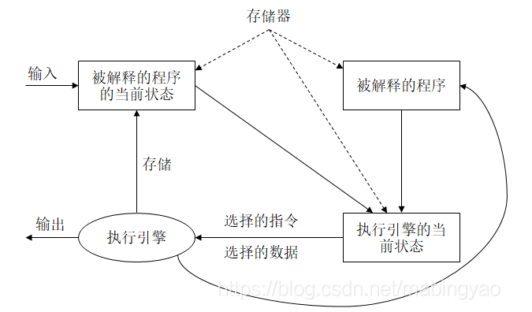

    ​	解释自定义规则，**解释引擎**、存储区、数据结构。

    ​	主要包含一个执行引擎和三个存储器。适用于系统和用户交互复杂的情况

    ​	优点： 跨平台移植能力高，可以仿真。

    ​	缺点： 执行效率低；特定语言和自定义规则，系统开销大； 难以实现和测试。

    ​	适用于模式匹配和语言编译器

  - **规则系统**

    ​	规则集、规则解释器、选择器和工作内存，用于**DSS**、**人工智能**、**专家系统**

- #### 仓库风格（数据共享体系风格）

  ​	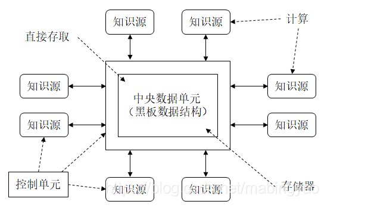

  ​	**现代编译器的集成开发环境IDE，以数据为中心。两种不同类型的软件元素： 中央数据单元和相互依赖的构建组。**

  - **数据库**

    ​	中央共享数据，独立处理单元。 由输入流中的时间驱动系统进行信息处理。

  - **超文本**

    ​	网状链接，多用于互联网。

  - **黑板**

    ​	包括知识源、黑板和控制三部分。语音识别、知识推理、解空间很大，求解过程不确定。由中央数据单元的当前状态驱动系统运行。

    ​	特点： 由知识源（信息来源，逻辑物理上独立）、中央数据单元（核心部分，多个知识源之间通信，存储数据和系统状态）、控制单元（由中央数据单元驱动，按需设计）组成。

    ​	优点： 多客户共享大数据，方便构件作为知识源添加。

    ​	缺点： 对于共享数据结构，不同知识源要达成一致，考虑各个知识源调用情况，共享数据结构修改困难。 需要同步和加锁保证数据的完整和一致性。

- #### 闭环-过程控制

  ​	汽车巡航定速、空调温度调节，发命令并接收反馈，不断调节。

  ​	优点： 将控制理论引入计算机软件体系结构中。

  ​	缺点： 只适用于特定领域

- #### C2风格

  ​	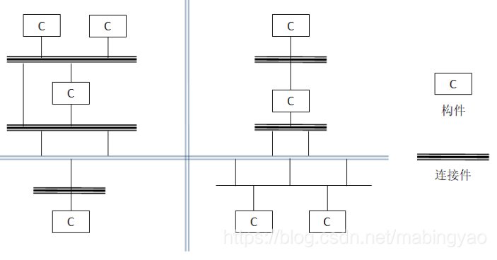

  ​	构件和连接件，顶部和底部， 通过连接件连接到一起并行构件网络。

  ​	基本构成：
  ​	（1）构件：构件之间所有通信必须使用消息传递机制实现。
  ​	（2）连接件负责消息的过滤、路由、广播、通信和相关处理。
  ​	（3）构件之间传递的消息：向上层构件发出服务请求的请求消息；向下层构件发送指示状态变化的通知消息。
  ​	特点：
  ​	（1）C2是一个层次网络
  ​	（2）核心思想是有限可视化，构件只能使用其上层构建提供的服务，不能感知下层构件的存在
  ​	（3）最上层构件是比较低级的逻辑操作，最下层是用户界面和I/O设备
  ​	（4）消息单向传递

  ​	（5）系统中的构件和连接件都有一个顶部和一个底部；

  ​	（6）构件的顶部应连接到某连接件的底部，构件的底部则应连接到某连接件的顶部，而构件与构件之间的直接连接是不允许的；

  ​	（7）一个连接件可以和任意数目的其它构件和连接件连接；

  ​	（8）当两个连接件进行直接连接时，必须由其中一个的底部到另一个的顶部。

  

  ​	优点：
  ​	（1）可使用任何编程语言开发构件，构件复用和替换容易
  ​	（2）具有一定的拓展能力，可以有多种不同粒度的构件。构件间相互独立，依赖性小
  ​	（3）构件不需要共享地址空间，避免共享全局变量造成复杂关系
  ​	（4）具有良好适应性
  ​	（5）可以动态更新系统的框架结构
  ​	补充：设计C2体系结构，应遵循组织规则和通信规则
  ​	（1）组织规则规定了C2体系结构的构建是以构件和连接件为基础的，定义了构件和连接件的顶部和底部
  ​	（2）通信规则规定了所有构件之间的交互必须通过异步消息机制来实现，是构件之间唯一通信方式
  ​	构件和连接件的关系
  ​	（1）构件顶部与连接件底部相连，构件底部与连接件顶部相连
  ​	（2）构件与构件不能直接相连
  ​	（3）与某一个连接件相关联的构件和连接件的数目没有限制

### 层次结构风格

#### 两层C/S架构

客户端和服务器都有处理功能，相比较于传统的集中式软件架构，还是有不少优点的，但是现在已经不常用，原因有：开发成本较高、客户端程序设计复杂、信息内容和形式单一、用户界面风格不一、软件移植困难、软件维护和升级困难、新技术不能轻易应用、安全性问题、服务器端压力大难以复用。

#### 三层C/S架构

将处理功能独立出来，表示层和数据层都变得简单。表示层在客户机上，功能层在应用服务器上，数据层在数据库服务器上。即将两层C/S架构中的数据从服务器中独立出来了。

其优点下面四点：

- 各层在逻辑上保持相对独立，整个系统的逻辑结构更为清晰，能提高系统和软件的可维护性和可扩展性；
- 允许灵活有效的选用相应的平台和硬件系统，具有良好的可升级性和开放性；
- 各层可以并行开发，各层也可以选择各自最适合的开发语言；
- 功能层有效的隔离表示层与数据层，为严格的安全管理奠定了坚实的基础，整个系统的管理层次也更加合理和可控制。

三层C/S架构设计的关键在于各层之间的通信效率，要慎重考虑三层间的通信方法、通信频度和数据量，否则即使分配给各层的硬件能力很强，性能也不高

#### 三层B/S架构

是三层C/S架构的变种，将客户端变为用户客户端上的浏览器，将应用服务器变为网络上的WEB服务器，又称为0客户端架构，虽然不用开发客户端，但有很多缺点，主要是数据处理能力差：B/S架构缺乏对动态页面的支持能力，没有集成有效的数据库处理功能；安全性难以控制；在数据查询等响应速度上，要远远低于C/S架构；数据提交一般以页面为单位，数据的动态交互性不强，不利于OLTP应用。

#### 混合架构风格

内外有别模型：企业内部使用C/S,外部人员访问使用B/S。

查改有别模型：采用B/S查询，采用C/S修改。

混合架构实现困难，且成本高。

#### 富互联网应用RIA

弥补三层B/S架构存在的问题，RIA是一种用户接口，比用HTML实现的接口更加健壮，且有可视化内容，本质还是网站模式，其优点如下：

- RIA结合了C/S架构反应速度快、交互性强的优点与B/S架构传播范围广及容易传播的特性；
- RIA简化并改进了B/S架构的用户交互；
- 数据能够被缓存在客户端，从而可以实现一个比基于HTML的响应速度更快且数据往返于服务器的次数更少的用户界面。

本质还是0客户端，借助于高速网速实现必要插件在本地的快速缓存，增强页面对动态页面的支持能力，典型的如小程序。

#### MVC架构

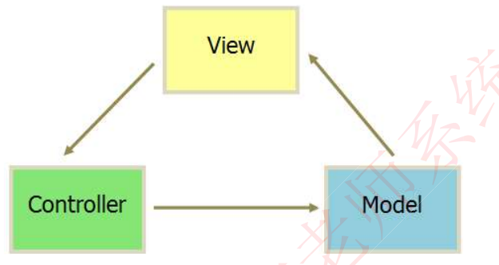

分为 Model、View、Controller（模型、视图、控制器）。 Model： 处理数据逻辑的部分，提供操作的数据对象。 View：数据显示部分，提供用户的操作界面。 Controller： 处理用户交互部分，按业务操作数据对象并产生输出。

优点： 有助于管理复杂的应用程序，分层开发，分层测试，同时可以支持不同开发人员可同时开发。

#### MVP

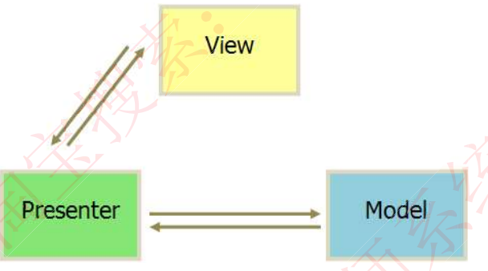

MVP是把MVC中的Controller换成了Presenter(呈现),目的就是为了完全切断View跟Model之间的联系，由Presenter充当桥梁，做到View-Model之间通信的完全隔离。

#### MVVM

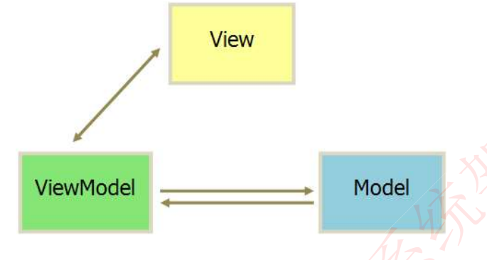

如果说MVP是对MVC的进一步改进，那么MVVM则是思想的完全变革。它是将“数据模型数据双向绑定”的思想作为核心，因此在View和Model之间没有联系，通过ViewModel进行交互，而且Model和ViewModel之间的交互是双向的，因此视图的数据的变化会同时修改数据源，而数据源数据的变化也会立即反应到View上。

#### J2EE

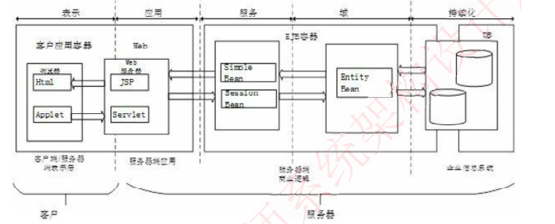

**客户层**：            基于Web或者传统的。 HTML、Applets。

**Web层组件**：    JSP或者Servlet。 Servlet一般接受用户输入并执行相关业务。JSP负责输出页面。

**业务层组件**：     满足特定领域的业务逻辑处理。

**构件包含客户端构件和服务器端构件两种类型**，其中，客户端构件主要包含**HTML、客户端显示资源**，服务器端构件分为两类**Web构件**（**Servlet与JSP**）和**EJB（Enterprise Java Beans）两种**

EJB： J2EE的服务器端组件模型。 包含三种Bean， **会话 Session Bean、实体 Entity Bean、消息驱动 Message Driver Bean**。

**Session Bean**： 与客户端的临时交互，处理客户与服务器交互的业务逻辑。

**Entity Bean**： 被持久化保存，数据库中存在的业务实体

**Message Driver Bean**： 允许一个业务层组件异步接受JMS的消息

#### 	JSP + SERVLET + JAVA BEAN + DAO

**JSP = V**， 用于显示、收集数据。

**Servlet = C**， 用于处理复杂的业务逻辑，会调用Service中的方法处理服务

**JavaBean**， 用于数据封装。 **Dao** 用于链接数据库和进行数据库操作。 **合在一起 = M**。

**JSP —> Servlet  —> Service —> Dao —> JAVA Bean —> Servlet —> JSP**

#### SOA架构

**SOA**是一种**粗粒度、松耦合**的服务架构，使用**简单、精确的定义接口**进行通信。可以根据需求**通过网络**将松散耦合的**粗粒度的应用**进行**分布式部署、组合、使用**。帮助**企业**可以快速建立**可靠、稳定、高重用**的**业务系统**架构，基于SOA的系统可以**适应业务的急剧变化**。

SOA包含多个服务，服务间通过相互依赖最终提供一系列完整的功能，各个服务单独部署，服务间通过网络调用。

实施SOA的**关键目标**是**实现企业IT资产重用的最大化**,具有以下**特征:**

可从企业**外部访问**、**随时可用**(服务请求能被及时响应)、**粗粒度接口**(粗粒度提供一项特定的业务功能，而细粒度服务代表了技术构件方法)、**服务分级**、**松散耦合**(服务提供者和服务使用者分离)、**可重用的服务及服务接口设计管理**、**标准化的接口**(WSDL、SOAP、**XML是核心**)、支持各种消息模式、精确定义的服务接口。

##### **基于服务的构件和传统构件的区别**：

- 服务构件粗粒度，传统构件细粒度居多
- 服务构件为WSDL接口， 传统构件API
- 服务构件与语言无关，传统构件有特定语言
- 服务构件可以通过构件容器提供QoS的服务，而传统构件完全由程序代码直接控制。

##### **关键技术**：

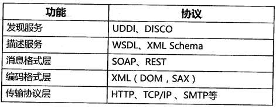

**发现服务**

​	**UDDI**:用于Web服务注册和服务查找，描述了服务的概念，定义了编程的接口，供其他企业来调用。

​	**DISCO**:发现公开服务的功能及交互协议。

**描述服务**

​	**WSDL **(WEB服务描述语言)协议：用于描述Web服务的接口和操作功能，描述网络服务。

**消息格式层**

​	**SOAP** 为建立Web服务和服务请求之间的通信提供支持。

​	**REST** (Representational State Transfer,表述性状态转移)是一种只使用HTTP和XML进行基于Web通信的技术，可以降低开发的复杂性，提高系统的可伸缩性。

**编码格式层**

​	扩展标记语言(Extensible Markup Language, **XML**),用于标记电子文件使其具有结构性的标记语言，可以用来标记数据、定义数据类型，是一种允许用户对自己的标记语言进行定义的源语言。

##### 		实现方式：

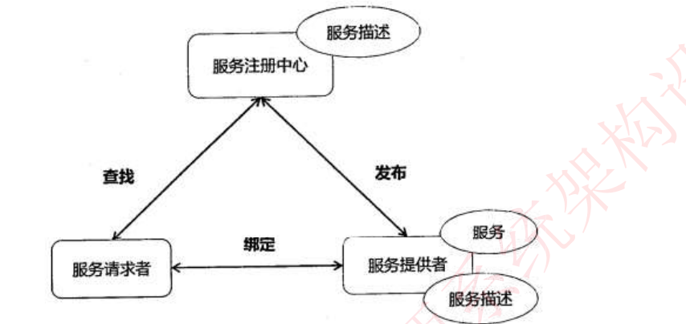

Web Service。服务提供者、服务注册中心(中介，提供交易平台，可有可无)、服务请求者。服务提供者将服

务描述发布到服务注册中心，供服务请求者查找，查找到后，服务请求者将绑定查找结果。

**六个层次**：

- ​	**底层传输层**(负责底层消息的传输，采用**HTTP**、**JMS**、**SMTP**协议)

- ​	**服务通信协议层**(描述并定义服务间通信的技术标准，采用**SOAP**和**REST**协议)

- ​	**服务描述层**(采用**WSDL**协议)

- ​	**服务层**(对企业应用系统进行包装，通过**WSDL**定义的标准进行调用)

- ​	**业务流程层**(支持服务发现、服务调用和点到点的服务调用，采用**WSDPEL**标准)

- ​	**服务注册层**(采用**UDDI**协议)。

  

**服务注册表**

​	**服务注册**：应用开发者(服务提供者)在注册表中公布服务的功能。

​	**服务位置**：服务使用者(服务应用开发者),帮助他们查询注册服务，寻找符合自身要求的服务。

​	**服务绑定**：服务使用者利用检索到的服务接口来编写代码，所编写的代码将与注册的服务绑定，调用注册的服务，以及与它们实现互动。

​	本质与WEB Service类似，只是使用一个注册表来代替服务注册中心。

**SOA需要解决的安全问题**：

1. **机密性**。对非法、非授权用户访问数据的限制，可采取加密措施。 
2. **完整性**。 数据的正确性、一致性、相容性。使用数字签名。 
3. **可审计性**。 事后监控措施。 
4. **认证管理**。 服务请求和提供需要互相鉴权。 
5. **授权管理**。 阻止未授权用户访问。 
6. **身份管理**。 对服务提供和请求者的身份进行管理。

采取： **XML加密模块、WS-Security、防火墙系统、安全检测、网络扫描**等安全策略。

#### **ESB**

**ESB**是一种由**中间件技术**实现的**面向服务架构**的基础软件平台，支持**异构环境中的服务**以及**基于消息和事件驱动的交互**，具有适当的**服务质量**和可管理性。

**特点**：

1. SOA的一种实现方式，起总线作用，将各个服务连接和整合。
2. 描述服务元数据和服务注册管理。
3. 在服务请求者和服务提供者之间传递数据，以及对这些数据进行转换的能力，支持有实践中总结出来的一些模式：同步模式、异步模式等。
4. 发现、路由、匹配和选择的能力，支持服务间动态交互，服务间解耦。

**主要功能**： 

- ​	提供位置透明性的消息路由和寻址服务；
- ​	提供服务注册和命名的管理功能；
- ​	支持多种的消息传递范型；
- ​	支持多种可以广泛使用的传输协议；
- ​	支持多种数据格式及其相互转换；
- ​	提供日志和监控功能。

1. 服务位置透明性。 2. 传输协议转换。 3. 消息格式转换。 4. 消息路由。 5. 消息增强。 6.安全性。7.监控与管理。

### 软件产品线

**软件产品线**（software product line）是一个**产品集合**，这些产品共享一个公共的、可管理的特征集，满足某个特定市场或任务的具体需要，是以规定的方式用公共的核心资产集成开发出来的。即围绕**核心资产库**进行**管理、复用、集成**新的系统。

两部分组成，分别是**核心资源**和**产品集合。**

四个基本技术特点，即**过程驱动**、**特定领域**、**技术支持**和**以架构为中心**。

适用范围：适合于专注于某个领域，在领域中有所积累，以后也是往这个领域发展，沉淀、固化这个领域的东西。

##### 过程模型－双生命周期模型

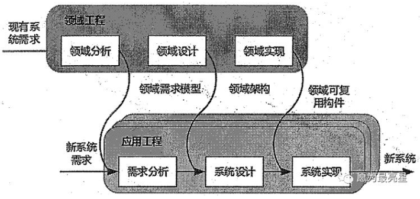

 双生命周期模型分为领域工程和应用功能两个生命周期。

领域工程阶段的主要任务有：

​	领域分析：利用现有系统的设计、架构和需求建立领域模型。

​	领域设计：用领域模型确定领域、产品线的共性和可变现，为产品线设计架构

​	领域实现：基于领域架构开发领域可重用资源（构件、文档、代码生成器）

应用工程阶段的主要任务有：

​	需求分析：将系统需求和领域需求比较，划分为领域公共需求和独特需求两大部分。

​	系统设计：在领域架构基础上，结合系统的独特需求设计应用的软件架构。

​	系统实现：根据应用架构，用领域可重用资源实现公共需求，用定制开发的构件满足系统独特需求，构建		新的系统。

### 软件架构复用

软件架构复用的类型包括机会复用和系统复用。机会复用是指开发过程中，只要发现有可复用的资产，就对其进行复用。系统复用是指在开发之前，就要进行规划，以决定哪些需要复用。

可复用的资产包括：需求、架构设计、元素、建模与分析、测试、项目规划、过程方法和工具、人员、样本系统、缺陷消除。

复用的基本过程主要包括3个阶段：首先构造/获取可复用的软件资产，其次管理这些资产(构件库),最后针对特定的需求，从这些资产中选择可复用的部分，以开发满足需求的应用系统。

### 特定领域软件架构 DSSA

特定领域软件架构DSSA以一个特定问题领域作为对象，形成由**领域参考模型**、***参考需求***、***参考架构***等组成的开发基础架构。其目标是支持一个特定领域中的多个应用生成。

**领域分析**主要目的为获取**领域模型**，**领域模型描述**领域中系统之间共同的需求，即**领域需求**。
		**领域设计**主要目的为**获取DSSA**，**DSSA描述**领域模型中表示**需求的解决方案**。
		**领域实现**的主要目的是依据**领域模型和DSSA**  **开发和组织可重用信息**，并对基础软件架构进行实现。

**垂直域**关注的是与行业相关的，聚焦于行业特性的内容。**水平域**关注的是各行业的共性部分。

**垂直域**：在**一个特定领域**中的通用的软件架构，是一个完整的架构。

**水平域**：在**多个不同特定领域**之间的相同的部分的小工具。

**人员组织**:

- **领域专家** -- 提供关于领域中系统的需求规约和实现的知识（不干活）

  ​		包括该领域中系统的有经验的用户、从事该领域中系统的需求分析、设计、实现以及

  项目管理的有经验的软件工程师等。提供关于领域中系统的需求规约和实现的知识，帮助组织规范的、

  一致的领域字典，帮助选择样本系统作为领域工程的依据，复审领域模型、DSSA等领域工程产品，

  等等。

- **领域分析者** -- 控制整个领域分析过程，知识获取并组织到领域模型中

  ​		由具有知识工程背景的有经验的系统分析员来担任。控制整个领域分析过程，进

  行知识获取，将获取的知识组织到领域模型中。

- **领域设计人员** -- 根据领域模型和现有系统开发出DSSA

  ​		由有经验的软件设计人员来担任。根据领域模型和现有系统开发出DSSA,并对

  DSSA的准确性和一致性进行验证。

- **领域实现人员** -- 根据领域模型和DSSA开发构件

  ​		由有经验的程序设计人员来担任。根据领域模型和DSSA,开发构件。

**领域三个层次**：

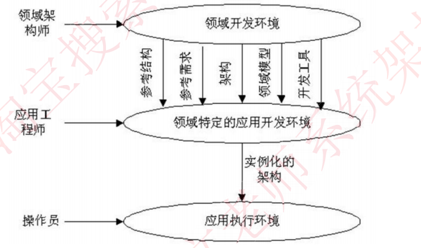

- **领域开发环境** ---  领域架构师

  ​	领域架构师决定核心架构，产出参考结构、参考需求、架构、领域模型、开发工

  具

- **领域特定开发环境** --- 应用工程师

  ​	应用工程师根据具体环境来将核心架构实例化

- **应用执行环境** --- 操作员

  ​	操作员实现实例化后的架构

### 软件架构质量效用树

- **性能**： 系统的响应能力。优先级队列、资源调度。
- **可用性**： 系统能够正常使用的时间。冗余、心跳、PingEcho、选举。
- **安全性**： 合法用户提供服务，非法用户拒接服务。 入侵检测、用户认证/授权，追踪审计。
- **可修改性**： 较高性价比对系统进行变更。 接口分离、信息隐藏、抽象。
- 可测试性： 发现故障、定位故障的能力。 远程调试接口。
- 功能性：是系统所能完成所期望的工作的能力。一项任务的完成需要系统中许多或大多数构件的相互协作。
- 可变性：指体系结构经扩充或变更而成为新体系结构的能力。这种新体系结构应该符合预先定义的规则，在某些具体方面不同于原有的体系结构。当要将某个体系结构作为一系列相关产品的基础时，可变性是很重要的。
- 互操作性：作为系统组成部分的软件不是独立存在的，经常与其他系统或自身环境相互作用。为了支持互操作性，软件体系结构必须为外部可视的功能特性和数据结构提供精心设计的软件入口。程序和用其他编程语言编写的软件系统的交互作用就是互操作性的问题，也影响应用的软件体系结构。

#### 质量属性场景

一种面向特定质量属性的需求。它由6部分组成：

- **刺激源**(Source): 这是某个生成该**刺激的实体**(人、计算机系统或者任何其他刺激器)。
- **刺激**(Stimulus): 该刺激是当刺激到达系统时需要考虑的**条件**。
- **环境**(Environment): 该刺激在**某些条件内发生**。当激励发生时，系统可能处于过载、运行或者其他情况。
- **制品**(Artifact): 某个制品被激励。这可能是整个**系统**，也可能是**系统的一部分**。
- **响应**(Response): 该响应是在激励到达后所采取的**行动**。
- **响应度量**(Measurement): 当响应发生时，应当能够以某种方式对其进行度量，以对需求进行**测试**

例如： 可修改性的质量属性场景：

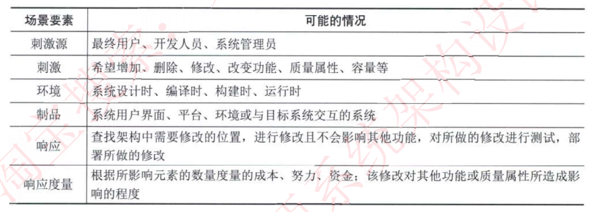

### 架构评估

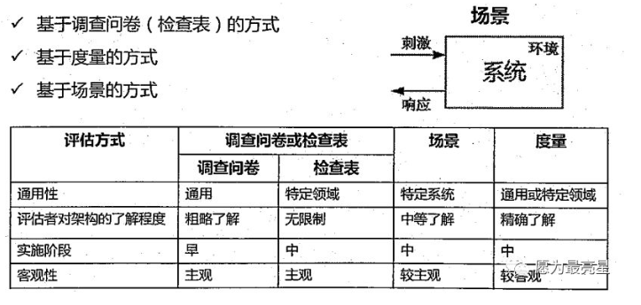

**软件架构评估**在**架构设计之后，系统设计之前**，因此与**设计、实现、测试**都**没有关系**。评估的目的是为了评估所采用的**架构是否能解决软件系统需求**，但不是单纯的确定是否满足需求。

目前普遍都用用**基于场景**的评估方式，方法： 首先确定应用领域的功能和软件架构的结构之间的映射，然后要设计用于体现待评估质量属性的场景(即4+1视图中的场景),最后分析软件架构对场景的支持程度。要求评估人员即对领域熟悉，也对架构熟悉。

- **风险点和非风险点**： 风险点指可能引起风险的因素。 非风险点指某个事件是可行的，可接受的。

- **架构风险**： 架构设计中潜在的、存在问题的架构决策所带来的隐患。

- **敏感点**： 实现某种特定质量属性，一个或多个系统所具有的特性。

- **权衡点**： 影响多个质量属性，对多个质量属性来说都是敏感点的系统属性

  

从三个方面对场景进行设计：**刺激**(事件);**环境**(事件发生的环境);**响应**(架构响应刺激的过程)。

主要的评估方法有：**架构权衡分析法**（ ATAM) 、软件架构分析法（ SAAM)、成本效益分析法（ CBAM)：

- **确定应用领域的功能和软件架构的结构之间的映射**
- **设计用于体现待评估质量属性的场景**
- **分析软件架构对场景的支持程度**

PS： 架构评估的方法不能够评估代码，评估的是架构的情况如何的，并且不是很精确的，他会有点偏差，也不能用来做测试。

#### 架构权衡分析法 ATAM

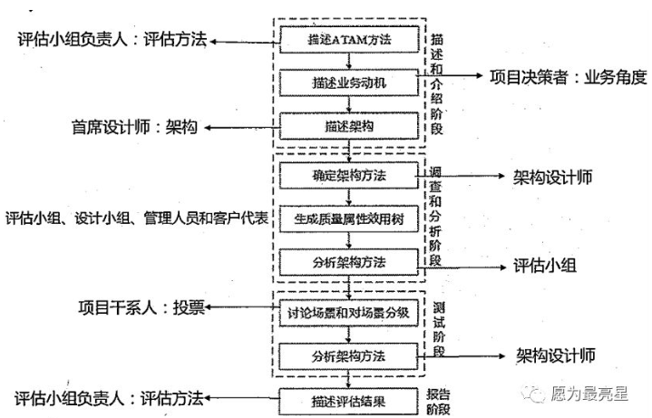

架构评估方法。在系统开发之前，针对其**性能、可用性、安全性、可修改性**等质量属性（效用树）进行**评价和折中**，主要关注系统的**需求说明**，强调**属性**作为架构**评估的核心**概念。

ATAM方法采用效用树(Utility tree)这一工具来对质量属性进行分类和优先级排序。效用树的结构包括：树根-质量属性-属性分类-质量属性场景(叶子节点)

ATAM四个阶段：

1. **需求收集**
2. **架构视图描述**
3. **属性模型改造和分析**
4. **架构决策和折中**

#### 软件架构分析法  SAAM

SAAM是一种非功能质量属性的架构分析方法，是最早形成文档并得到广泛应用的软件架构分析方法。

特定目标。SAAM的目标是对描述应用程序属性的文档，验证基本的架构假设和原则。

质量属性。这一方法的基本特点是把任何形式的质量属性都具体化为场景，但可修改性是SAAM分析的主要质量属性。

架构描述。SAAM用于架构的最后版本，但早于详细设计。架构的描述形式应当被所有参与者理解。功能、结构和分配被定义为描述架构的3个主要方面。

方法活动。SAAM的主要输入是问题描述、需求声明和架构描述。下图描绘了SAAM分析活动的相关输入及评估过程。包括5个步骤，即场景开发、架构描述、单个场景评估、场景交互和总体评估。

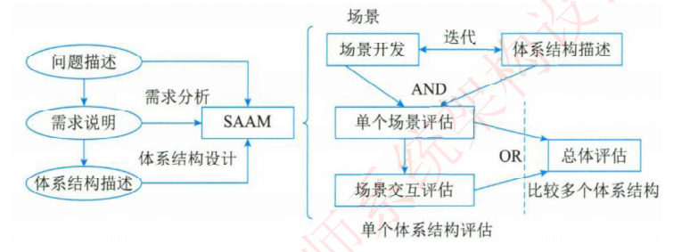

#### 成本效益分析法 CBAM

用来对架构建立的成本来进行设计和建模，让决策者根据**投资收益率**来选择合适的架构，可以看做对**ATAM的补充**，在ATAM确定质量合理的基础上，再对效益进行分析。有下列步骤：

- 整理场景（确定场景，并确定优先级，选择三分之一优先级最高的场景进行分析);
- 对场景进行求精（对每个场景详细分析，确定最好、最坏的情况);
- 确定场景的优先级(项目干系人对场景投票，根据投票结果确定优先级);
- 分配效用（对场景响应级别确定效用表，建立策略、场景、响应级别的表格);
- 形成”策略－场景－响应级别”的对应关系
- 确定期望的质量属性响应级别的效用(根据效用表确定所对应的具体场景的效用表);
- 计算各架构策略的总收益
- 根据受成本限制影响的投资报酬率选择架构策略 （估算成本，用上一步的收益减去成本，得出收益，并选择收益最高的架构策略)。

